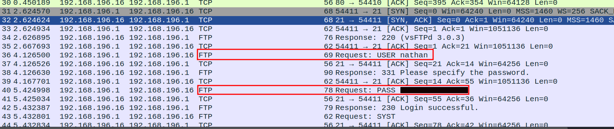
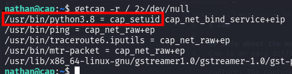
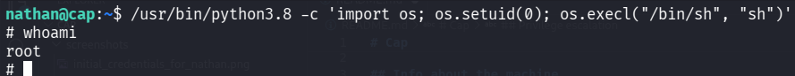

# Cap

## Info about the machine
Cap is an easy difficulty Linux machine running an HTTP server that performs administrative functions including performing network captures. Improper controls result in Insecure Direct Object Reference (IDOR) giving access to another user's capture. The capture contains plaintext credentials and can be used to gain foothold. A Linux capability is then leveraged to escalate to root.

------------------------------------------------------------------------

## Initial Enumeration

The initial `nmap` scan revealed the following open ports:

-   `21` - FTP
-   `22` - SSH
-   `80` - HTTP

The web server hosted a functionality that allowed users to generate
short network captures (5-second `.pcap` files).

The capture download endpoint followed this structure:

    /data/<capture_id>

The application did not properly validate ownership of these captures,
resulting in an IDOR vulnerability. By changing the `capture_id` value,
it was possible to access captures belonging to other users.

The capture containing sensitive information was identified as:

    /data/0

------------------------------------------------------------------------

## Initial Access

The retrieved packet capture contained plaintext credentials for the
user `nathan`.



These credentials were valid for both FTP and SSH access, allowing
authentication as the user `nathan`.

------------------------------------------------------------------------

## Privilege Escalation

After gaining access as `nathan`, further enumeration revealed that the
Python 3.8 binary had the `setuid` Linux capability enabled.



This capability allowed Python to change its effective user ID to
`root`. The following command was used to spawn a root shell:

``` bash
/usr/bin/python3.8 -c 'import os; os.setuid(0); os.execl("/bin/sh", "sh")'
```

Successful privilege escalation was confirmed by obtaining a shell
running as root.


