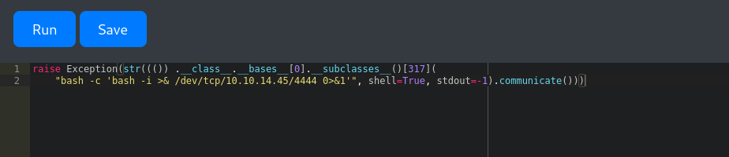
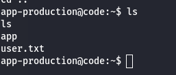
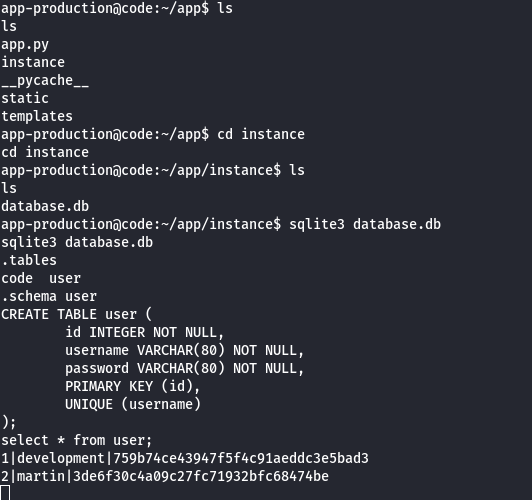
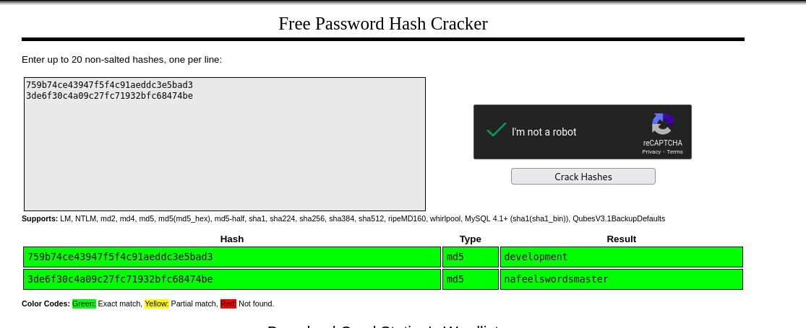
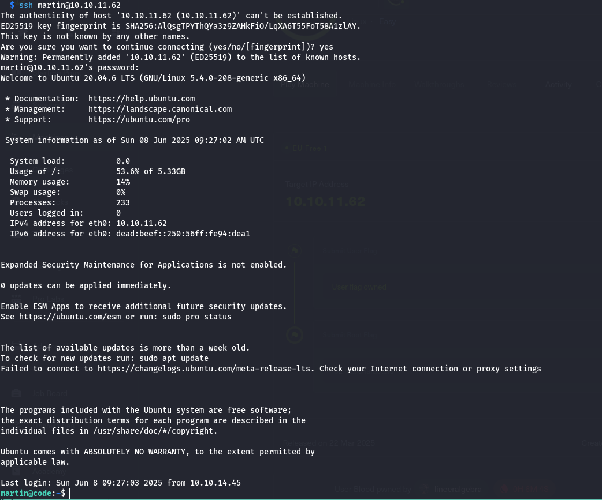
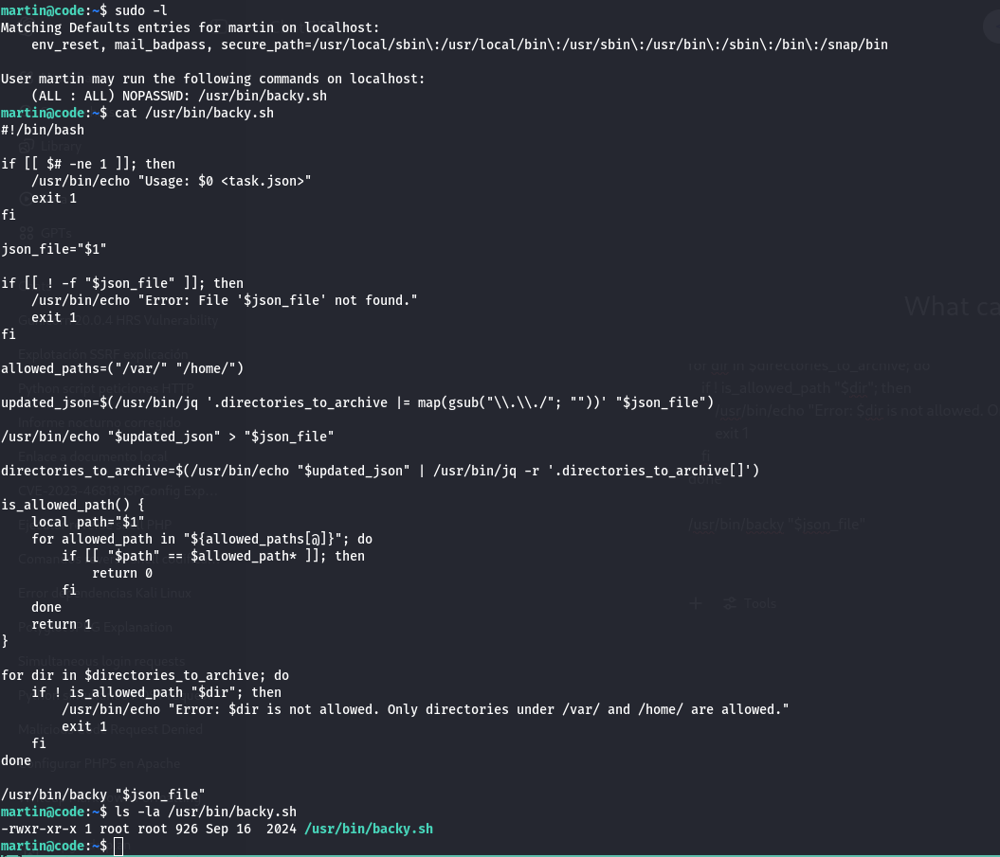
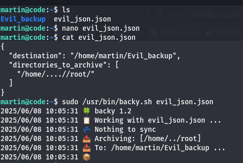
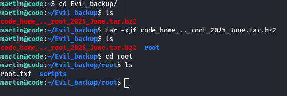

# Code Walkthrough

## Enumeration

We began our exploration with a standard Nmap scan and identified two open ports:

```
PORT     STATE SERVICE VERSION
22/tcp   open  ssh     OpenSSH 8.2p1 Ubuntu 4ubuntu0.12 (Ubuntu Linux; protocol 2.0)
| ssh-hostkey: 
|   3072 b5:b9:7c:c4:50:32:95:bc:c2:65:17:df:51:a2:7a:bd (RSA)
|   256 94:b5:25:54:9b:68:af:be:40:e1:1d:a8:6b:85:0d:01 (ECDSA)
|_  256 12:8c:dc:97:ad:86:00:b4:88:e2:29:cf:69:b5:65:96 (ED25519)
5000/tcp open  http    Gunicorn 20.0.4
|_http-title: Python Code Editor
|_http-server-header: gunicorn/20.0.4
```

Port 5000 hosted a web application — a Python code editor running via Gunicorn. Directory brute-forcing did not reveal any hidden endpoints.

## Gaining a Reverse Shell

The online Python interpreter had security measures in place, such as restricted access to `import` statements. After trial and error, we managed to escape the Python sandbox and execute code for a reverse shell. The working payload is shown below:



This allowed us to gain an initial foothold and capture the user flag:



## Privilege Escalation

During post-exploitation enumeration, we discovered a database file containing MD5-hashed credentials:



We cracked the hashes using CrackStation, revealing plaintext credentials:



Using the cracked credentials, we successfully logged in as user `martin`:



Running `sudo -l` revealed that `martin` could execute a backup script with root privileges:



### Exploiting the Backup Script

The script accepted a JSON file specifying directories to back up. By crafting a malicious JSON file that referenced paths indirectly pointing to `/root`, we were able to create a backup containing sensitive root files:



Upon extracting the backup, we accessed and read the `root.txt` flag:

