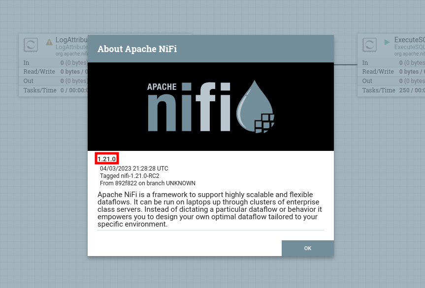
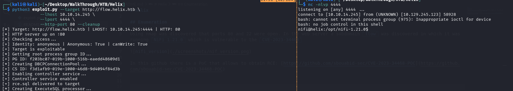
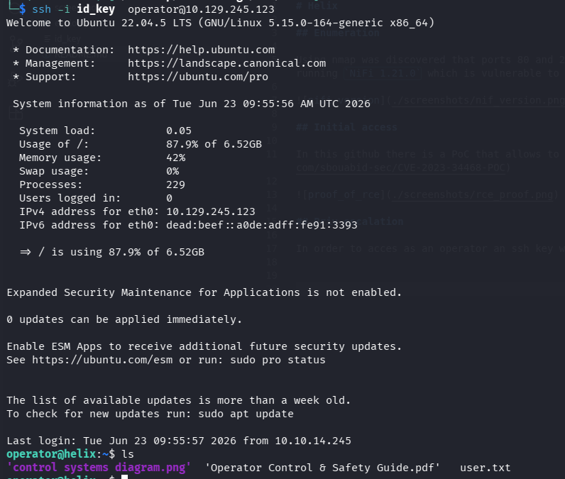
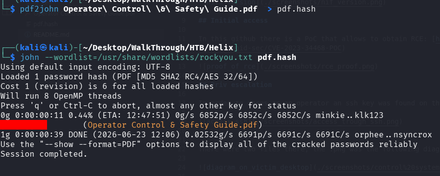
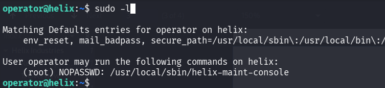
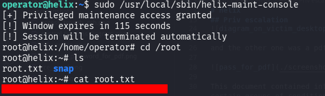

# Helix

## Enumeration

The initial enumeration phase was performed using **Nmap**, which
revealed that ports **80** and **22** were open.

After analyzing the web service running on port 80, a subdomain named
`flow` was discovered. This subdomain hosted **Apache NiFi 1.21.0**,
which was identified as vulnerable to **CVE-2023-34468**.



## Initial Access

A public proof of concept for **CVE-2023-34468** was available on
GitHub:

https://github.com/sbouabid-sec/CVE-2023-34468-POC

The exploit allowed remote code execution on the target system,
providing the initial foothold.



## Privilege Escalation

After gaining access to the machine, further enumeration revealed an SSH
private key backup located at:

``` text
/opt/nifi-1.21.0/support-bundles/operator_id_ed25519.bak
```

This key allowed access to the operator account through SSH.



Inside the user's files, two relevant documents were discovered.

The first file was an image containing a control systems diagram:


The second file was a password-protected PDF. The password was recovered
using **John the Ripper**.



The PDF contained information about the PLC variables and the conditions
required to enable the maintenance window.

The maintenance window logic was:

``` text
(Temperature >= ~295 OR Pressure >= ~73)
AND
Temperature < ~305
AND
Pressure < ~75
AND
TripActive == False
AND
Mode == MAINTENANCE
AND
TestOverride == True
```

The operator account had permissions to interact with the PLC interface.
The available privileges were identified using:



To interact with the OPC UA PLC service, the required node identifiers
were first obtained using:

[obtain_ids.py](./scripts/obtain_ids.py)

After identifying the required variables, the maintenance conditions
were triggered using:

[exploit.py](./scripts/exploit.py)

This allowed the maintenance window to be reached and provided a path to
execute commands with elevated privileges.


