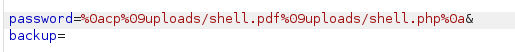
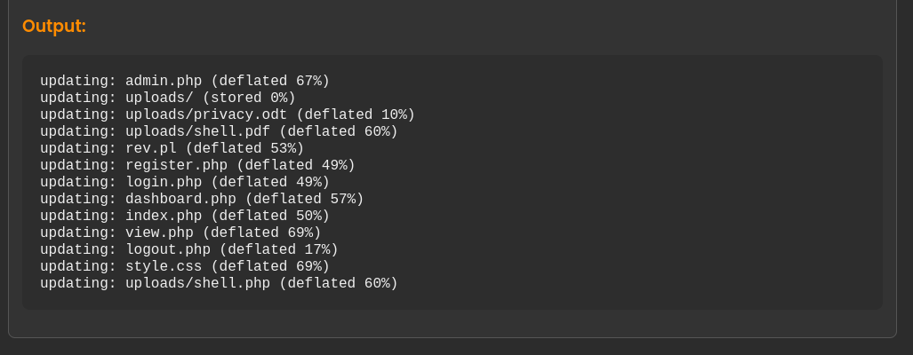
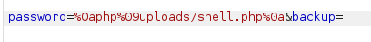
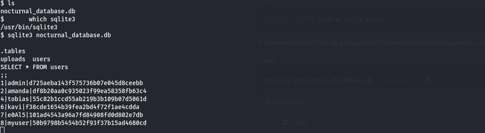
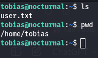
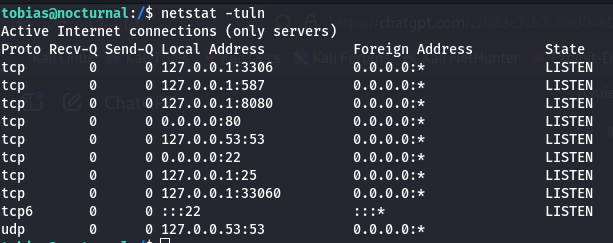
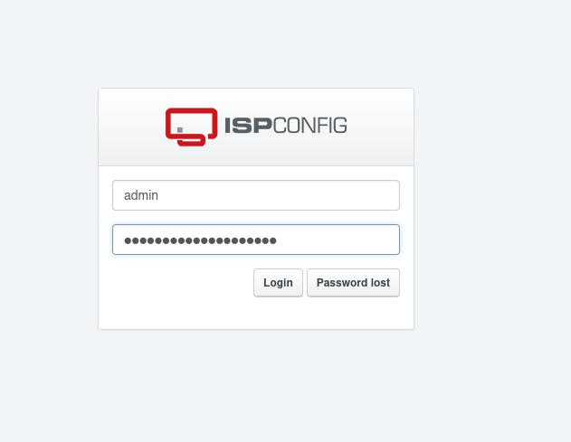
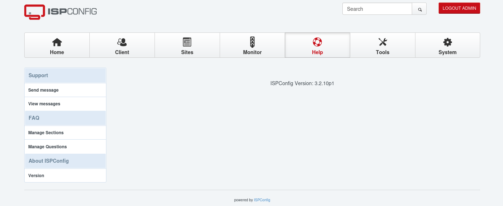
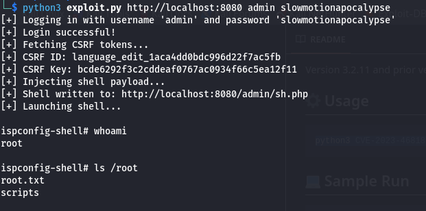

# Nocturnal

## Enumeration

The following information was discovered through an Nmap scan:

```
PORT   STATE SERVICE VERSION
22/tcp open  ssh     OpenSSH 8.2p1 Ubuntu 4ubuntu0.12 (Ubuntu Linux; protocol 2.0)
| ssh-hostkey: 
|   3072 20:26:88:70:08:51:ee:de:3a:a6:20:41:87:96:25:17 (RSA)
|   256 4f:80:05:33:a6:d4:22:64:e9:ed:14:e3:12:bc:96:f1 (ECDSA)
|_  256 d9:88:1f:68:43:8e:d4:2a:52:fc:f0:66:d4:b9:ee:6b (ED25519)
80/tcp open  http    nginx 1.18.0 (Ubuntu)
|_http-title: Did not follow redirect to http://nocturnal.htb/
|_http-server-header: nginx/1.18.0 (Ubuntu)
Device type: general purpose|router
Running: Linux 5.X, MikroTik RouterOS 7.X
OS CPE: cpe:/o:linux:linux_kernel:5 cpe:/o:mikrotik:routeros:7 cpe:/o:linux:linux_kernel:5.6.3
OS details: Linux 5.0 - 5.14, MikroTik RouterOS 7.2 - 7.5 (Linux 5.6.3)
Network Distance: 2 hops
Service Info: OS: Linux; CPE: cpe:/o:linux:linux_kernel
```

Since a web page is accessible, we attempted to enumerate subdomains and directories, but nothing of interest was found. Therefore, I began searching for vulnerabilities on the site.

The page allows users to upload files, limited to a few formats like `.pdf`, `.odt`, etc. During exploration using Burp Suite, I noticed a difference in responses when requesting a non-existent file versus requesting it as an invalid user. This behavior allowed me to enumerate valid users in the application using the following script:

[**user_enum.py**](./scripts/user_enum.py)

With this, I discovered two users:

```
amanda and admin
```

Using this information, I was able to enumerate their files using the script:

[**files_enum.py**](./scripts/files_enum.py)

This revealed a file named `privacy.odp`. To retrieve it, we simply accessed the URL:


The contents of the file revealed the following credentials:

```
amanda:arHkG7HAI68X8s1J
```

## Obtaining a Reverse Shell

With Amanda's credentials, I gained access to the admin panel. One of its functionalities allows downloading a backup ZIP file protected by a password. I discovered that the password parameter was vulnerable to command injection.

To exploit this and obtain a reverse shell, I first uploaded a PHP reverse shell inside a file with a `.pdf` extension to bypass the upload restriction. The reverse shell used was:

[**shell.pdf**](./scripts/shell.pdf)

After uploading the file, I copied it with a `.php` extension using the command injection vulnerability:



I verified the success of this step and the storage location by inspecting the backup feature:



Finally, I executed the reverse shell while listening with Netcat using the following command:



## Obtaining Shell Access

Exploring the system, I found the application's database. It contained the following users and hashed credentials:



Using [CrackStation](https://crackstation.net/), I cracked the hash and obtained:

```
tobias:slowmotionapocalypse
```

Using these credentials, I connected via SSH and obtained the user flag:



## Privilege Escalation

Once logged in as Tobias, I discovered a service running on port 8080:



I forwarded the port to my machine with the command:

```
ssh -L 8080:localhost:8080 tobias@10.10.11.64
```

Accessing the service, I logged in using the following credentials:

```
admin:slowmotionapocalypse
```



I identified the version as vulnerable to CVE-2023-46818:



I used the proof of concept from this [repository](https://github.com/ajdumanhug/CVE-2023-46818), and successfully obtained root access:

