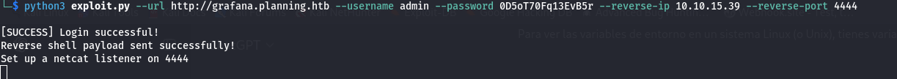
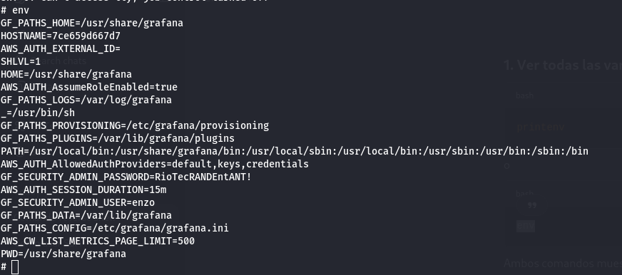
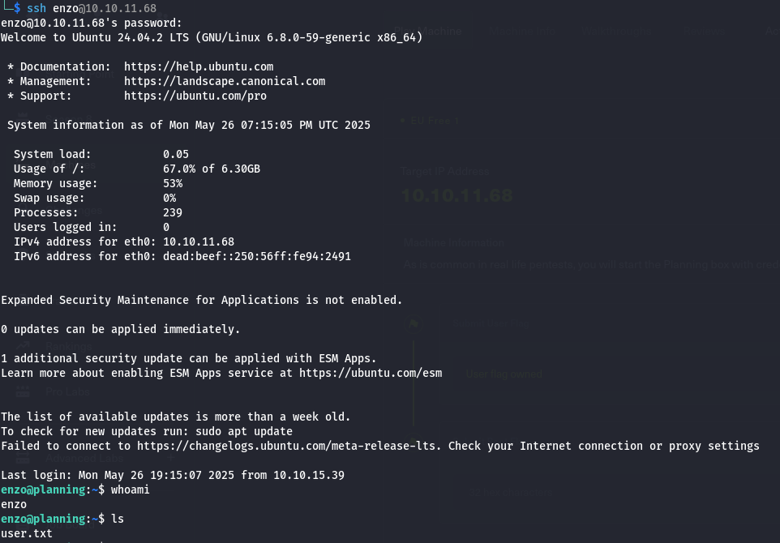
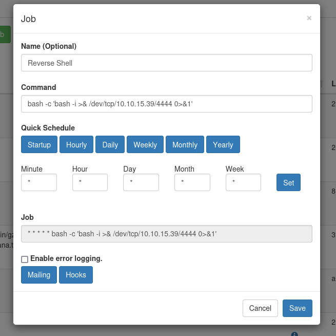

# Planning

In this machine, you are given the following credentials:

```
admin / 0D5oT70Fq13EvB5r
```

## Enumeration

### Nmap

The following was discovered from the Nmap scan:

```
PORT   STATE SERVICE VERSION
22/tcp open  ssh     OpenSSH 9.6p1 Ubuntu 3ubuntu13.11 (Ubuntu Linux; protocol 2.0)
| ssh-hostkey: 
|   256 62:ff:f6:d4:57:88:05:ad:f4:d3:de:5b:9b:f8:50:f1 (ECDSA)
|_  256 4c:ce:7d:5c:fb:2d:a0:9e:9f:bd:f5:5c:5e:61:50:8a (ED25519)
80/tcp open  http    nginx 1.24.0 (Ubuntu)
|_http-title: Did not follow redirect to http://planning.htb/
|_http-server-header: nginx/1.24.0 (Ubuntu)
```

We now know that SSH is running and a web server is hosted on port 80.

To access the web interface correctly, we need to add the machine’s IP to our `/etc/hosts` file as follows:

```
<IP_ADDRESS> planning.htb
```

### Directories and Files

No interesting files or directories were discovered during the initial directory enumeration.

### Subdomain Discovery

Using the following command, we discovered a subdomain: `http://grafana.planning.htb`, which leads to a Grafana admin panel.

```
ffuf -w /usr/share/seclists/Discovery/DNS/namelist.txt -u http://FUZZ.planning.htb -H "Host: FUZZ.planning.htb"
```

We can log into this Grafana panel using the initial credentials:

```
admin / 0D5oT70Fq13EvB5r
```

#### Grafana Version

To identify the version of Grafana, we used the following command:

```
wget http://grafana.planning.htb/api/health
```

The response was:

```json
{
  "commit": "83b9528bce85cf9371320f6d6e450916156da3f6",
  "database": "ok",
  "version": "11.0.0"
}
```

This version is vulnerable to Remote Code Execution (RCE) via CVE-2024-9264.

## Exploitation

### Initial Shell

We exploit the RCE vulnerability using the following proof of concept:

[https://github.com/z3k0sec/CVE-2024-9264-RCE-Exploit](https://github.com/z3k0sec/CVE-2024-9264-RCE-Exploit)

Example exploit usage:



While exploring the system, we discovered a script using environment variables. By dumping the environment variables:



We found the following credentials:

```
enzo:RioTecRANDEntANT!
```

### User Flag

With the `enzo` credentials, we SSH into the machine:

```
ssh enzo@10.10.11.68
```

The user flag is located in Enzo’s home directory.



## Privilege Escalation

We run `linpeas.sh` to automate local enumeration. While analyzing the results, we found root credentials in the file `/opt/crontabs/crontab.db`:

```
root:P4ssw0rdS0pRi0T3c
```

Additionally, a service is running on port 8000. We access it by tunneling:

```
ssh -L 8000:localhost:8000 enzo@10.10.11.68
```

This service is a web interface for managing cron jobs, and it runs with root privileges.

To gain root access, we create a new cron job to get a reverse shell.



We now have root access, and the root flag is located in the `/root` directory.

