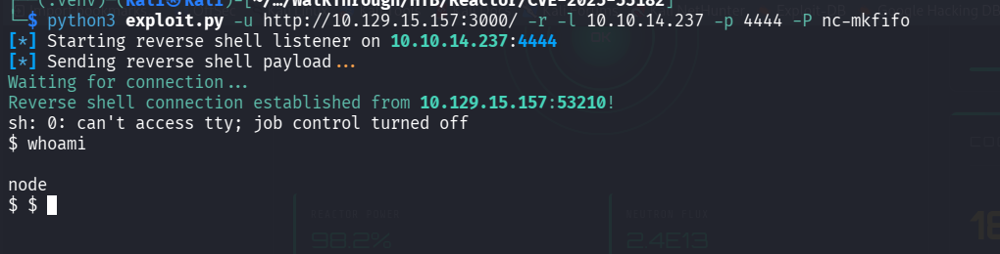
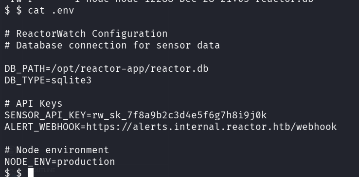
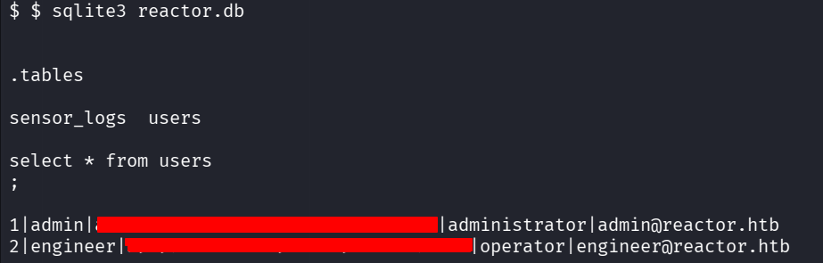
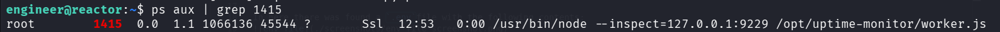
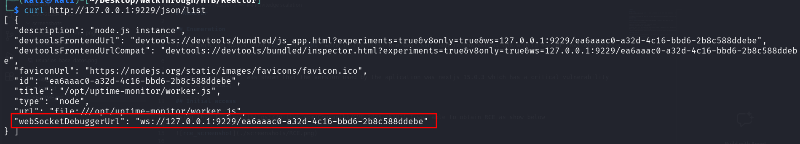
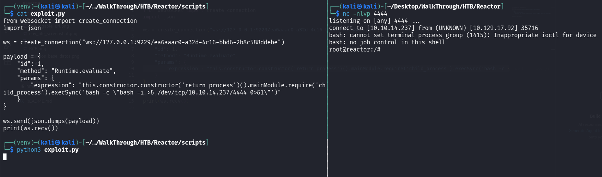

# Reactor - HTB Writeup

## Enumeration

During the initial reconnaissance phase, two open ports were identified on the target machine:

- **22/tcp** — SSH service
- **3000/tcp** — HTTP web application

The web application running on port 3000 appeared to be a monitoring dashboard for a nuclear reactor system.

Using Wappalyzer, it was determined that the application was built with **Next.js 15.0.3**, which is affected by a critical vulnerability (**CVE-2025-55182**).

---

## Initial Access

Exploitation of the application was achieved using the following public exploit:

https://github.com/Chocapikk/CVE-2025-55182

This resulted in **Remote Code Execution (RCE)** on the target system, as shown below:

---

During post-exploitation, a `.env` file was discovered containing sensitive configuration data:

Further enumeration revealed a SQLite database file named `reactor.db`, which contained a table with two users: **admin** and **engineer**. Their passwords were stored as MD5 hashes:

After cracking the hashes, the plaintext credentials for the user **engineer** were recovered. These credentials were then used to obtain SSH access to the system.

---

## Privilege Escalation

During local enumeration, a service was identified listening on `localhost:9229`. After forwarding the port to the local machine, it was confirmed that this was a **Node.js remote debugging interface** running with **root privileges**.

The exposed debugging interface allowed interaction with the Node.js runtime as root. Using the following exploit script, it was possible to execute arbitrary code and obtain a root shell:

[exploit script](./scripts/exploit.py)

As shown below, root access was successfully achieved:

---

## Conclusion

This machine demonstrated the risks of multiple misconfigurations chained together:

- Exposure of sensitive application data (.env)
- Weak password storage (MD5 hashes)
- Reused credentials
- Exposed Node.js debugging interface running as root

By chaining these issues, full system compromise was achieved from initial access to root.
