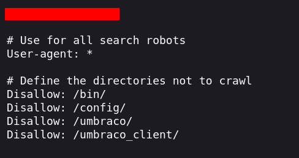
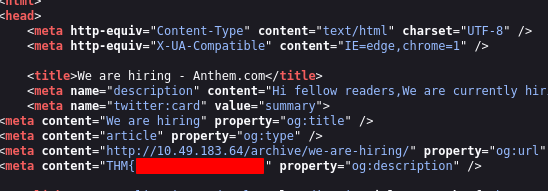
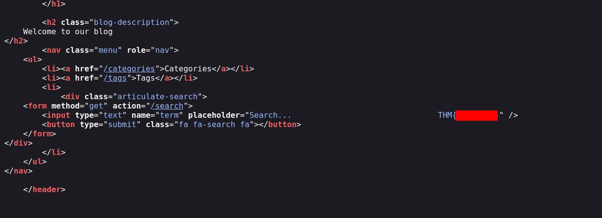
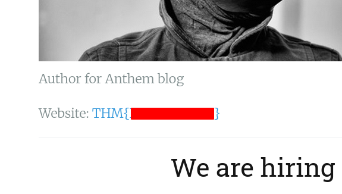
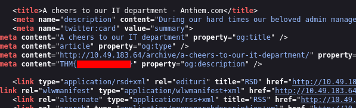
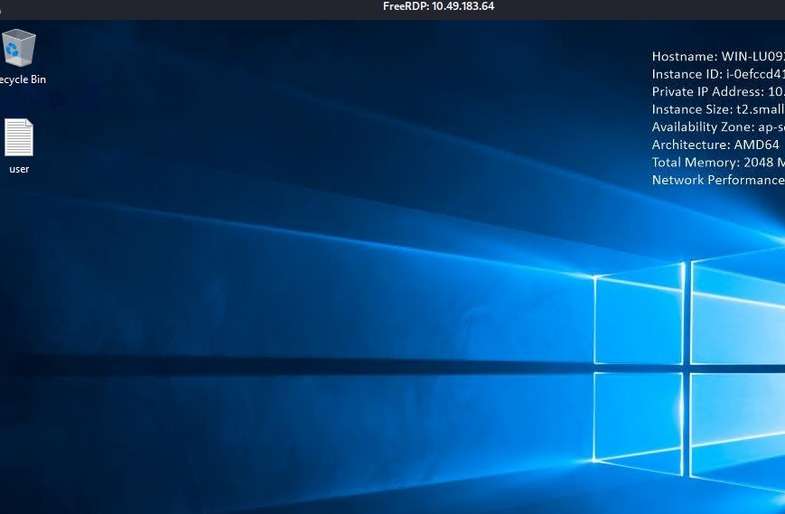
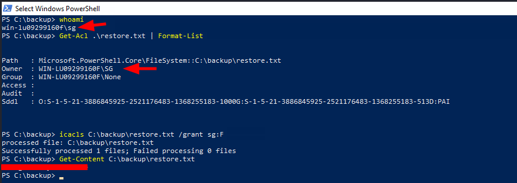
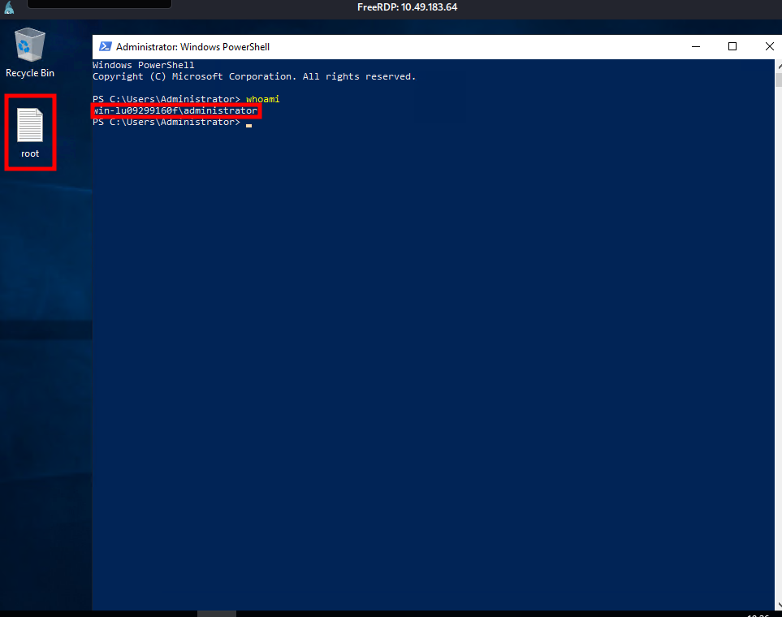

# Anthem

## Enumeration

The initial enumeration revealed two open ports on the Windows machine:

-   **Port 80/tcp**: HTTP web server
-   **Port 3389/tcp**: Microsoft Remote Desktop Protocol (RDP)

### Robots.txt Enumeration

I inspected the `robots.txt` file, which revealed hidden paths that were
disallowed for web crawlers. It also exposed a potential password:

One of the discovered paths pointed to the Umbraco CMS installation,
confirming that the website was running **Umbraco**.

### Identifying the Administrator

While reviewing the website content, I found a clue in one of the posts:

    Born on a Monday,
    Christened on Tuesday,
    Married on Wednesday,
    Took ill on Thursday,
    Grew worse on Friday,
    Died on Saturday,
    Buried on Sunday.
    That was the end…

Searching for this clue revealed that the name was **Solomon Grundy**.
Based on this information, I identified the administrator username as:

    SG

I also discovered another user's email address on the website:

    JD@anthem.com

Using the same naming convention, I inferred that the administrator
email address was likely:

    SG@anthem.com

### Website Flag Discovery

Several flags were hidden throughout the website source code and
profiles.

The first flag was found inside a meta tag of an article:

The second flag was located in the HTML source code of the main page:

The third flag was found in Jane Doe's user profile page:

The final flag was again hidden inside a meta tag in another article's
HTML source:

## Initial Access

Using one of the paths discovered in `robots.txt`, I accessed:

    http://<IP>/umbraco/

This displayed the Umbraco administrator login page. Using the password
discovered in `robots.txt` and the previously identified administrator
email, I successfully authenticated to the Umbraco administration
panel.

Although access to the CMS was achieved, it did not provide a direct
path for further exploitation. Therefore, I attempted to reuse the
discovered credentials against the exposed RDP service.

This resulted in successful remote access to the Windows machine:

### Privilege Escalation / Administrator Access

While enumerating the filesystem, I discovered a hidden directory:

    C:\backup

Inside this directory was a file:

    C:\backup\restore.txt

The file was owned by the current user, but it did not grant read
permissions. I verified the ownership and permissions:

    whoami

    WIN-LU09299160F\SG

    Get-Acl .\restore.txt

The output showed that `SG` was the owner of the file, but no read
permissions were assigned.

Because the current user owned the file, I was able to modify the NTFS
permissions:

    icacls C:\backup\restore.txt /grant sg:F

After granting full control, I was able to read the contents:

    Get-Content C:\backup\restore.txt

The file contained the administrator password

The successful administrator access was confirmed:

