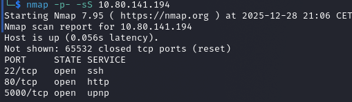
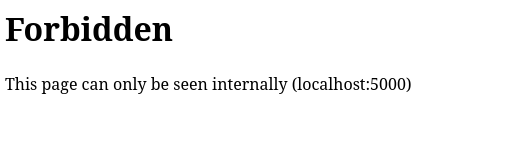
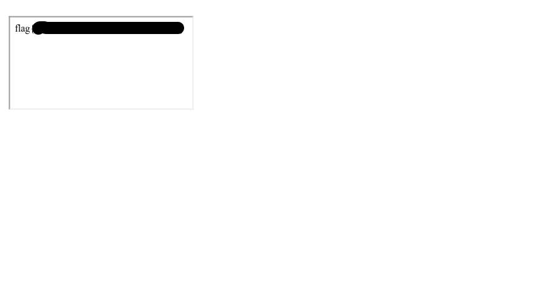

# MD2PDF — Walkthrough

---

## Overview

The **MD2PDF** challenge focuses on abusing how user-controlled Markdown/HTML content is rendered into a PDF.  
By carefully inspecting the exposed services and understanding how the PDF generation works, it is possible to access restricted internal resources and retrieve the flag.

---

## Enumeration

An initial full TCP port scan was performed using **Nmap**, which revealed the following open ports:

- **22/tcp** — SSH  
- **80/tcp** — HTTP  
- **5000/tcp** — HTTP service (likely a backend application)



---

### Directory Discovery

Directory enumeration was performed using **ffuf** against the web server on port 80.  
This revealed the existence of an `/admin` endpoint.

However, attempting to access it directly resulted in a **403 Forbidden** response:



This indicates that the endpoint exists but is intentionally restricted from direct access.

---

## Exploitation

The application converts user-supplied Markdown into a **PDF document**.  
Importantly, it does **not properly sanitize embedded HTML**, allowing raw HTML tags to be interpreted during PDF generation.

By injecting the following HTML payload into the Markdown input:

```html
<iframe src="http://localhost:5000/admin"></iframe>
```

the PDF renderer attempts to load the `/admin` page **from the server itself**.

### Why This Works

- `localhost` resolves to the **server**, not the attacker
- The request originates internally, bypassing access controls
- The rendered PDF includes the contents of the restricted `/admin` page

This effectively results in a **server-side request forgery (SSRF-like behavior)** through HTML injection.

---

## Result

When the generated PDF is rendered, the contents of the `/admin` page are embedded directly into the document, revealing the flag:



