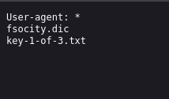
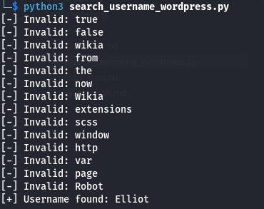
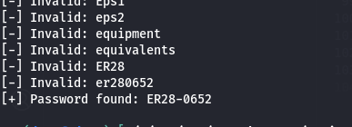
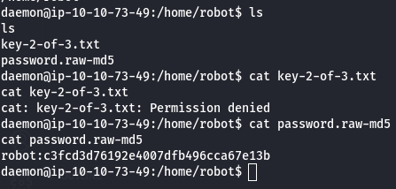
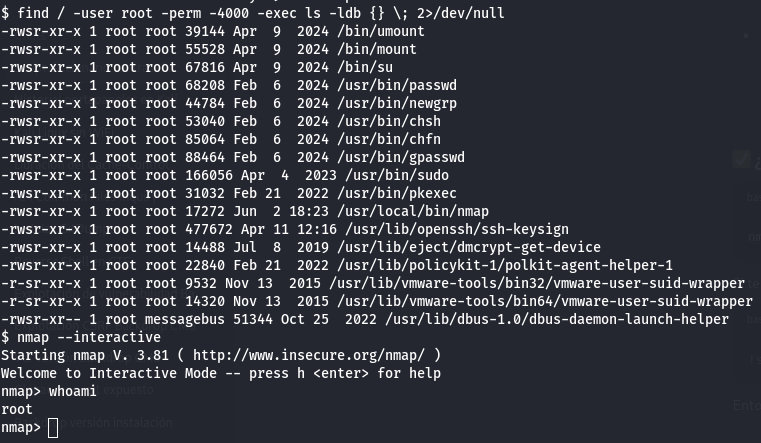

# Mr Robot CTF

*Mr Robot CTF* is a medium-difficulty TryHackMe machine themed around the TV series *Mr. Robot*.

---

## Enumeration

Initial service enumeration was performed using **Nmap**, revealing the following open ports and services:

```
PORT    STATE SERVICE  VERSION
22/tcp  open  ssh      OpenSSH 8.2p1 Ubuntu 4ubuntu0.13 (Ubuntu Linux; protocol 2.0)
80/tcp  open  http     Apache httpd
443/tcp open  ssl/http Apache httpd
```

Further details indicated this was a Linux-based machine.

Since a web service is available, **FFUF** was used for content discovery, revealing the following interesting directories:

```
blog, sitemap, rss, login, feed, video, image, wp-content, admin, wp-login,
intro, license, wp-includes, js, readme, robots, dashboard, wp-admin,
phpmyadmin, 0000
```

Among these, two stood out:

- `/robots` which led to the first flag and a dictionary file.
- `/login` which revealed a WordPress login form.

The `/robots` give me the first flag and a route to a dictionary:

<p align="center">
  
</p>

Attempting to log in with arbitrary credentials, the application responded with an "invalid username" message—indicating we could enumerate valid usernames based on this response.

I downloaded the dictionary file and removed duplicate entries:

```bash
wget --no-check-certificate https://10.10.30.32/fsocity.dic -O dictionary.txt
sort -u dictionary.txt > dictionary_without_repetitions.txt
```

I then used the script [search_username_wordpress.py](scripts/search_username_wordpress.py) to identify a valid username.

<p align="center">
  
</p>

Once the username was found, I used another script [get_password_wordpress.py](scripts/get_password_wordpress.py) to brute-force the password.

<p align="center">
  
</p>

---

## Reverse Shell

After logging in, I uploaded a reverse shell as a malicious WordPress plugin: [exploit.php](scripts/evil-plugin/exploit.php) (It has to be uploaded as a zip file).

Upon gaining shell access, I found an MD5 hash on the system which, when cracked, allowed me to SSH into the box.

<p align="center">
  
</p>

The second flag was located in the user's home directory.

---

## Privilege Escalation

I manually explored several privilege escalation vectors, including:

- Checking for `sudo` privileges
- Searching for SUID binaries

Eventually, I found that `nmap` had the SUID bit set. Using `nmap`'s interactive mode, I achieved root access.

<p align="center">
  
</p>

The last flag was in the root directory.