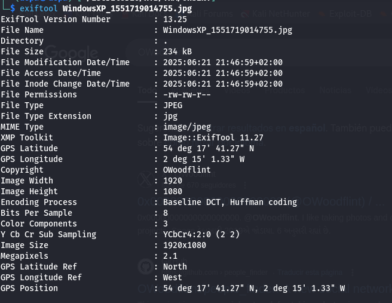
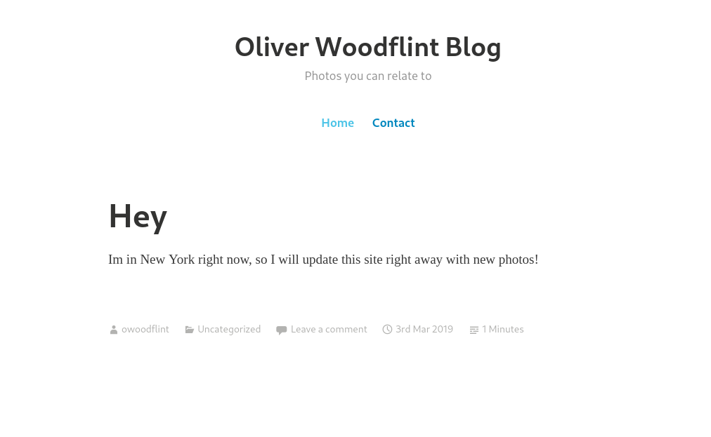
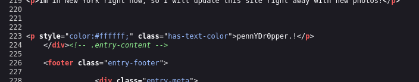

# OhSINT - CTF Walkthrough

This is an OSINT (Open Source Intelligence) challenge where you are provided with a single image and asked to answer several questions based on the information you can extract from it.

---

## Questions

1. What is this user's avatar of?  
2. What city is this person in?  
3. What is the SSID of the WAP he connected to?  
4. What is his personal email address?  
5. What site did you find his email address on?  
6. Where has he gone on holiday?  
7. What is the person's password?  

---

## Step-by-Step Walkthrough

### Step 1: Extract Metadata from the Image

To begin the challenge, I used `exiftool` on the provided image to extract metadata.

From the metadata, I discovered the username: `OWoodflint`.

---

### Step 2: Investigate the Username

Searching for `OWoodflint` online led me to his X (formerly Twitter) profile and GitHub account.

- **Avatar (Q1):** A cat  
- **City (Q2):** London (visible in his social profiles)  
- **Email Address (Q4):** `OWoodflint@gmail.com`

---

### Step 3: Check GitHub for Additional Clues

On GitHub, `OWoodflint` had only one repository. In the README of that repository, I found his **email address** (Q4) as well as a link to his **WordPress website**.

- **Email Source (Q5):** GitHub repository README

---

### Step 4: Examine the WordPress Site

On his WordPress site, it was evident from the images and blog posts that he was on vacation in:

- **Holiday Destination (Q6):** New York

---

### Step 5: Find the Hidden Password

Viewing the source code of the WordPress site, I found white text hidden in the HTML. This turned out to be his **password**.

- **Password (Q7):** Hidden in source code using white-on-white text styling

---

###  Step 6: Determine Wi-Fi SSID

From his X profile, I discovered the following BSSID:

- `BSSID: B4:5D:50:AA:86:41`

Using [Wigle](https://wigle.net/), I searched for the BSSID and found:

- **SSID (Q3):** `UnileverWiFi`

---

## Summary of Answers

1. **Cat**  
2. **London**  
3. **UnileverWiFi**  
4. **OWoodflint@gmail.com**  
5. **GitHub Repository README**  
6. **New York**  
7. **pennYDr0pper.!**  