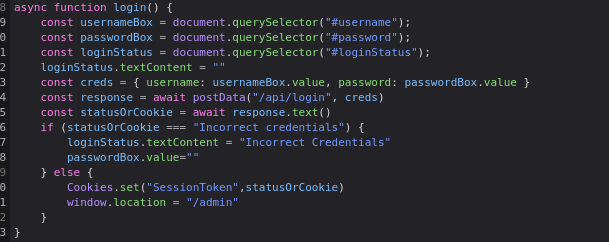
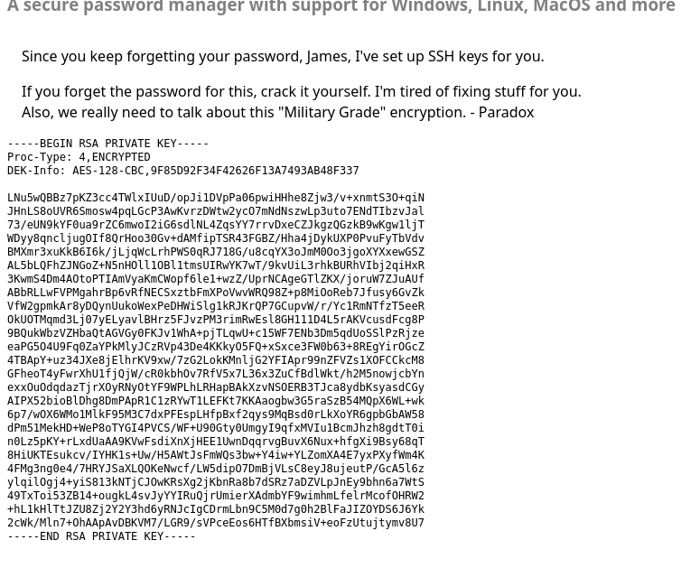
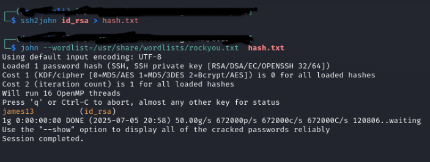
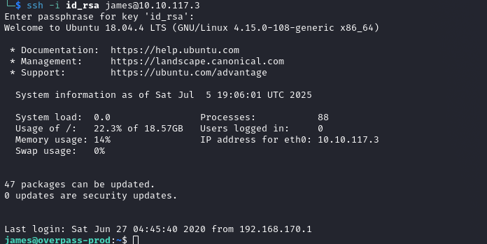
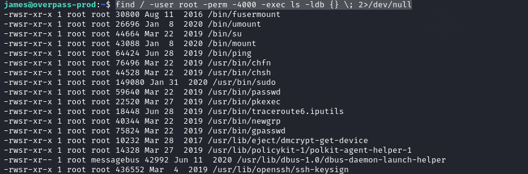
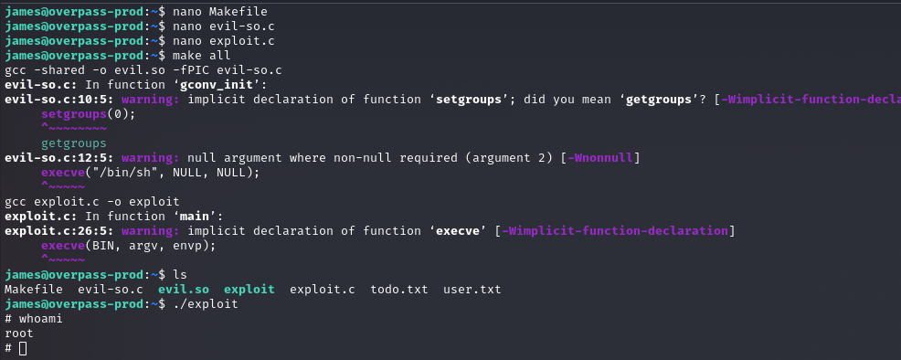

# Overpass

---

## Enumeration

Initial scanning with **Nmap** revealed the following open ports:

```
PORT   STATE SERVICE
22/tcp open  ssh
80/tcp open  http
```

Using `ffuf`, I discovered a hidden `/admin` directory. This directory contained a login portal for the admin panel.

The authentication mechanism was poorly implemented and could be bypassed by manually setting the `SessionToken` cookie. Here's the vulnerable code:



By setting the `SessionToken` to any arbitrary value, I gained unauthorized access to the admin panel.

Inside the panel, I found a private RSA key associated with the user `james`:



To log in as `james` via SSH, I needed the passphrase for the RSA key. I used **John the Ripper** to crack it successfully:



After obtaining the passphrase, I was able to SSH into the target as `james`:



---

## Privilege Escalation

Next, I searched for binaries with the SUID bit set and owned by `root`:



Among the listed binaries, I investigated known vulnerabilities and discovered an exploit for **PolicyKit**:

📎 [Exploit 50689 - PolicyKit Privilege Escalation](https://www.exploit-db.com/exploits/50689)

Using this exploit, I successfully escalated privileges and gained root access:



---
