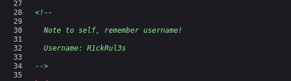
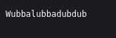
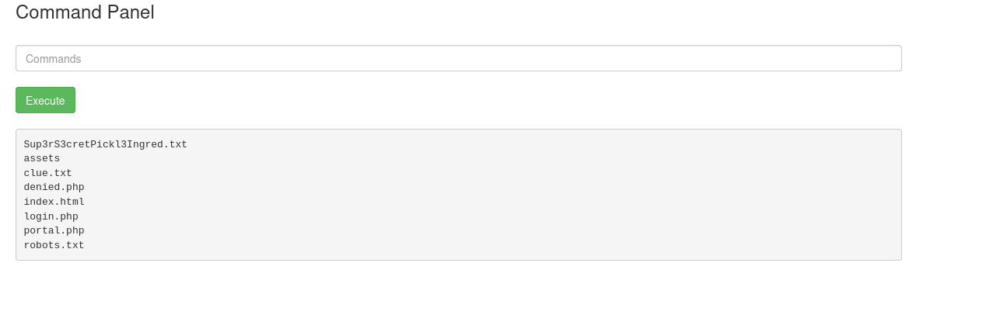
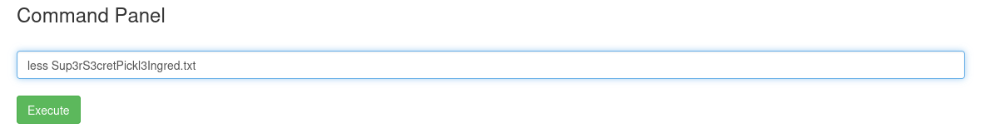
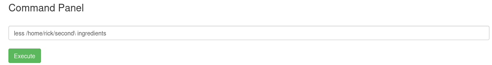
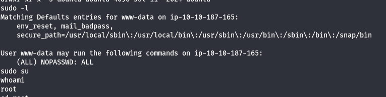
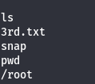

# Pickle Rick

*Pickle Rick* is a Rick & Morty-themed machine where the goal is to log into Rick's system and recover the **three secret ingredients** needed to complete a potion that will return him to normal.

---

## Enumeration

Initial service enumeration was done using **Nmap**, revealing the following:

```
PORT   STATE SERVICE VERSION
22/tcp open  ssh     OpenSSH 8.2p1 Ubuntu 4ubuntu0.11 (Ubuntu Linux; protocol 2.0)
| ssh-hostkey: 
|   3072 73:e0:e7:15:f1:58:91:02:06:0c:8e:5d:d2:93:49:20 (RSA)
|   256 4e:4e:79:c6:ce:d6:e6:e9:f9:37:45:3b:f6:1c:cb:73 (ECDSA)
|_  256 ea:4e:81:4c:4b:71:b1:ca:eb:8c:a4:23:fd:7d:ff:32 (ED25519)
80/tcp open  http    Apache httpd 2.4.41 ((Ubuntu))
|_http-server-header: Apache/2.4.41 (Ubuntu)
|_http-title: Rick is sup4r cool
```

OS details suggest it's running **Linux kernel 4.15**.

Using **FFUF**, the following web files and directories were discovered:

```
assets/                 [301]
index.html              [200]
login.php               [200]
portal.php              [302]
robots.txt              [200]
.ht* and .htaccess*     [403]
server-status           [403]
denied.php              [302]
```

---

## Initial Access

Inspecting the page source of `index.html` revealed a username in a comment:

<p align="center">
  
</p>

The password was found in `robots.txt`:

<p align="center">
  
</p>

With these credentials, logging into `portal.php` gave access to a web-based command interface. Some commands like `cat` were blocked.

From here, we obtained the **first and second ingredients**:

<p align="center">
  
</p>

To bypass the `cat` restriction, we used alternative commands:

<p align="center">
  
</p>

This led to retrieving the **second ingredient**:

<p align="center">
  
</p>

---

## Reverse Shell

After experimenting with different payloads, we successfully gained a shell using this reverse shell command:

<p align="center">
  
</p>

---

## Privilege Escalation

Privilege escalation was simple thanks to passwordless `sudo` access:

<p align="center">
  
</p>

This allowed access to the **third and final ingredient**:

<p align="center">
  
</p>

