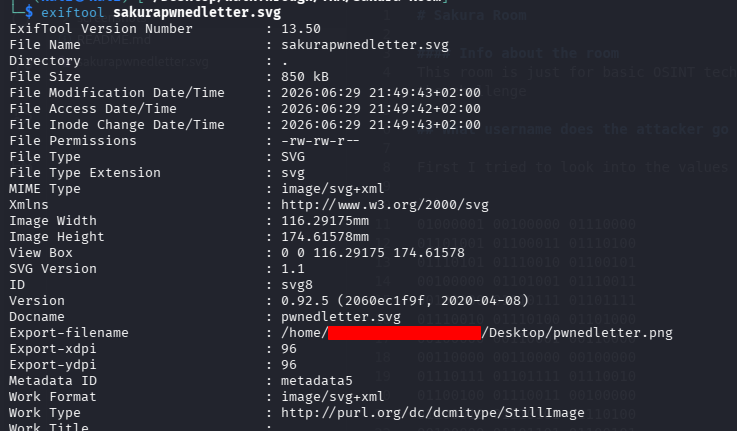
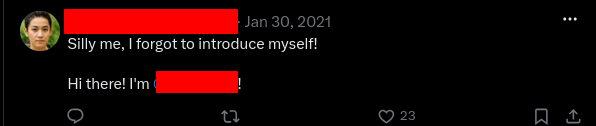

# Sakura Room

## Room Overview

This room focuses on basic OSINT (Open Source Intelligence) techniques.
In this write-up, I will explain the methodology used to find the
answers to each question presented in the challenge.

------------------------------------------------------------------------

## What username does the attacker go by?

The first step was analyzing the image provided in the challenge. I
noticed there was a binary sequence embedded in the background of the
image, so I decided to decode it.

The binary translated to:

    A picture is worth 1000 words but metadata is worth far more

This message suggested that the image metadata could contain useful
information. Based on this clue, I used `exiftool` to inspect the
metadata of the image.

The metadata revealed the attacker's username.

------------------------------------------------------------------------

## What is the full email address used by the attacker?

After discovering the attacker's username, I searched for related online
accounts and repositories.

One of the attacker's GitHub repositories contained a PGP key. By
analyzing the information stored in the key, I was able to extract the
attacker's full email address.

------------------------------------------------------------------------

## What is the attacker's full real name?

Using the previously discovered username, I searched for associated
social media accounts.

I found the attacker's personal Twitter account, where a post revealed
their full real name.

------------------------------------------------------------------------

## What cryptocurrency does the attacker own a cryptocurrency wallet for?

While investigating the attacker's GitHub profile, I found a personal
mining script for this cryptocurrency.

------------------------------------------------------------------------

## What is the attacker's cryptocurrency wallet address?

The cryptocurrency wallet address was found in the first commit of the
repository containing the mining script.

------------------------------------------------------------------------

## What mining pool did the attacker receive payments from on January 23, 2021 UTC?

To identify the mining pool, I searched the discovered wallet address on
Etherscan and reviewed its transaction history.

The transaction details from January 23, 2021 UTC revealed the mining
pool that the attacker received payments from.

------------------------------------------------------------------------

## What other cryptocurrency did the attacker exchange with using their cryptocurrency wallet?

By analyzing the wallet's transaction history on Etherscan, I was able
to identify other cryptocurrencies that were exchanged using the wallet.

------------------------------------------------------------------------

## What is the attacker's current Twitter handle?

The attacker's current Twitter handle was identified from the same
Twitter account discovered earlier during the investigation.

------------------------------------------------------------------------

## What airport is closest to the location the attacker shared a photo from prior to getting on their flight?

The photo shared by the attacker before their flight contained a
recognizable landmark in the background.

Using this landmark, I identified the city where the photo was taken.
After locating the city, I searched for nearby airports to determine the
closest one.

------------------------------------------------------------------------

## What airport did the attacker have their last layover in?

The attacker shared an image related to their layover.

Using reverse image search, I was able to identify the airport shown in
the image.

------------------------------------------------------------------------

## What lake can be seen in the map shared by the attacker as they were on their final flight home?

The attacker shared a map image during their final flight.

By comparing the map with the geography of Japan using Google Maps, I
was able to pinpoint the location and identify the lake shown.

------------------------------------------------------------------------

## What city does the attacker likely consider "home"?

During the investigation, a WiFi network list was discovered containing
an entry named:

    City Free WiFi

This value provided the final clue to determine the city that the
attacker likely considered their home.
